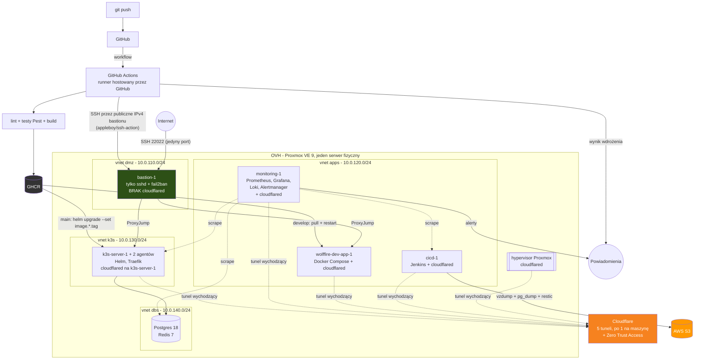

# WolfFire - infrastruktura i CI/CD

Projekt dyplomowy DevOps. Repozytorium opisuje **całą infrastrukturę jako kod**:
maszyny wirtualne, sieć, firewall, konfigurację systemów, monitoring i pipeline
CI/CD dla aplikacji WolfFire - systemu CRM/ERP napisanego w Laravelu.

Infrastruktura stawiana jest od zera trzema komendami i jest idempotentna.

---

## Architektura



**Jedyny ruch przychodzący z internetu trafia na SSH bastionu (port 22022).**
Bastion ma publiczny adres IPv4 i publiczny IPv6 (darmowy blok OVH), ale
przyjmuje wyłącznie SSH - chronione logowaniem kluczem, fail2banem i limitem
prób (`MaxAuthTries`). Nie nasłuchuje na 80/443 i nie terminuje żadnego tunelu
Cloudflare. Cała reszta ruchu - panele administracyjne i aplikacje - wchodzi
tunelami Cloudflare, po jednym na maszynę usługową (hypervisor, `cicd-1`,
`monitoring-1`, `wolffire-dev-app-1`, `k3s-server-1`), terminowanym lokalnie
na tej maszynie. Panele administracyjne dodatkowo chroni Zero Trust Access.

### Maszyny

| Maszyna | Segment | Adres | RAM | Rola |
|---|---|---|---|---|
| `bastion-1` | dmz | 10.0.110.10 | 1,5 GB | Jedyny punkt wejścia z internetu - SSH 22022, jump host |
| `cicd-1` | apps | 10.0.120.10 | 5 GB | Runner GitHub Actions (hostowany przez GitHub) uderza tu przez SSH; lokalnie stoi Jenkins |
| `monitoring-1` | apps | 10.0.120.20 | 5 GB | Prometheus, Grafana, Loki, Alertmanager |
| `wolffire-dev-app-1` | apps | 10.0.120.30 | 2,5 GB | Środowisko dev - Docker Compose |
| `k3s-server-1` | k3s | 10.0.130.10 | 3 GB | Control plane + Traefik |
| `k3s-agent-1` | k3s | 10.0.130.11 | 2,5 GB | Pody aplikacji |
| `k3s-agent-2` | k3s | 10.0.130.12 | 2,5 GB | Pody aplikacji |
| `wolffire-prod-db-1` | dbs | 10.0.140.10 | 3 GB | Postgres 18 + Redis 7 |

Razem 25 GB z 31 GB fizycznych - reszta zostaje hostowi i ARC-owi ZFS-a.

### Podział ról w CI/CD

| Narzędzie | Odpowiada za |
|---|---|
| **GitHub Actions** | Lint, testy, budowa i publikacja obrazu do GHCR, wdrożenie na dev (`develop`) i prod (`main`), powiadomienia |
| **Jenkins** | Kopie zapasowe zasobów Proxmoxa do S3 (`vzdump`, `pg_dump`, restic), zadania cykliczne |

### Jak wdrożenie dociera do maszyn bez publicznego adresu

GitHub Actions korzysta z **runnerów hostowanych przez GitHub** - nie stoją
w tej infrastrukturze. Krok lint/testy/build nie potrzebuje nic więcej. Krok
wdrożenia musi jednak połączyć się z maszyną bez publicznego adresu - robi to
po SSH, proxy'owanym przez **publiczny adres IPv4 bastionu** (akcja
`appleboy/ssh-action` z hostem pośredniczącym ustawionym na bastiona), a stamtąd
dalej do `wolffire-dev-app-1` albo `k3s-server-1`. To jedyne miejsce, w którym
pipeline dotyka adresu publicznego - i jedyny ruch, jaki bastion w ogóle
przepuszcza.

---

## Zawartość repozytorium

| Katalog | Zawartość |
|---|---|
| `terraform/` | Infrastruktura: maszyny, sieć SDN, firewall hypervisora, DNS, tunele |
| `ansible/` | Konfiguracja wnętrza maszyn: system, Docker, k3s, bazy, monitoring, Jenkins |
| `helm/wolffire/` | Chart Helma aplikacji produkcyjnej na k3s |
| `keys/` | Klucze SSH - publiczne w repo, prywatne w `.gitignore` |
| `scripts/` | Testy dymne infrastruktury (`smoke-test.sh`), wyłącznie odczyt |
| `docs/` | Architektura, przewodnik po repo, runbook, plan realizacji |
| `secrets.sops.yaml` | Poświadczenia providerów, zaszyfrowane kluczem age |

Aplikacja mieszka w osobnym repozytorium (fork WolfFire) razem z `Dockerfile`
i publikacją obrazu do **GHCR** (GitHub Container Registry) - kod aplikacji
i kod infrastruktury mają niezależne cykle życia.

---

## Wymagania wstępne

```bash
brew install terraform ansible sops age
ansible-galaxy collection install -r ansible/requirements.yml
```

Klucz age do odszyfrowania sekretów musi leżeć w `~/.config/sops/age/keys.txt`.
Bez niego żadna komenda operująca na infrastrukturze nie ruszy.

---

## Wdrożenie od zera

```bash
make bootstrap-host        # 1. bootstrap hosta Proxmoxa - jednorazowo, po instalacji OVH
make tf-apply       # 2. Terraform: sieć, storage, firewall, 8 maszyn wirtualnych
make ansible-apply   # 3. Ansible: konfiguracja wszystkiego wewnątrz maszyn
```

Albo `make up`, które robi kroki 2 i 3. `make help` wypisuje wszystkie cele.

Każdy krok jest idempotentny - ponowne uruchomienie na gotowej infrastrukturze
nie wprowadza zmian.

### Dlaczego `make bootstrap-host` jest osobno

Problem kury i jajka: Terraform potrzebuje użytkownika i tokenu API Proxmoxa,
a te mogą powstać dopiero na działającym hoście. `ansible/bootstrap-host.yml`
łączy się rootem na świeżo zainstalowany serwer i przygotowuje grunt - ogranicza
ARC ZFS-a, zakłada konta maszynowe, utwardza SSH i wystawia token API.

To jedyny moment, w którym cokolwiek dotyka serwera spoza normalnego przepływu.

---

## Sekrety

Poświadczenia **nie są zmiennymi Terraforma** i nie ma ich w `tfvars`. Siedzą
zaszyfrowane w `secrets.sops.yaml` i wchodzą do procesu jako zmienne środowiskowe:

```bash
make secrets     # edycja - odszyfrowuje w edytorze, zapisuje zaszyfrowane
```

SOPS szyfruje **wartości, nie nazwy kluczy** - `git diff` pokazuje, który sekret
się zmienił, nie ujawniając czym jest. Ten sam klucz age obsługuje Terraform
(`sops exec-env`) i Ansible (plugin `community.sops` odszyfrowuje `group_vars`
w locie).

Hasło administratora Proxmoxa nie istnieje nigdzie poza stanem - generuje je
Terraform (`random_password`), odczyt jednorazowo:

```bash
terraform -chdir=terraform output -raw proxmox_initial_password
```

---

## Dostęp do maszyn

```bash
cd ansible
ssh wf-proxmox-1          # host
ssh wf-k3s-server-1       # maszyna wirtualna, ProxyJump ustawi się sam
```

Domyślnie łączysz się kontem maszynowym `ansible`. Kontem imiennym: `ssh
mserwinowski@wf-bastion-1` (ProxyJump przenosi tę samą tożsamość dalej).
Prefiks `wf-` jest wymagany - bez niego SSH może trafić na hosta o tej samej
nazwie z innego projektu. Model tożsamości opisuje [`keys/README.md`](keys/README.md).

Cała topologia połączeń (porty, ProxyJump przez bastiona) siedzi w `ansible/ssh_config`,
używanym równocześnie przez Ansible i ręcznie - jedno źródło prawdy zamiast
powielania adresów w inventory.

---

## Dokumentacja

- [`docs/ARCHITECTURE.md`](docs/ARCHITECTURE.md) - decyzje projektowe wraz z uzasadnieniem
- [`docs/PRZEWODNIK.md`](docs/PRZEWODNIK.md) - przewodnik po plikach repozytorium: co gdzie jest i co edytować
- [`docs/RUNBOOK.md`](docs/RUNBOOK.md) - komendy operacyjne, diagnostyka, procedury awaryjne
- [`docs/PLAN.md`](docs/PLAN.md) - plan realizacji i bieżący status
- [`keys/README.md`](keys/README.md) - model tożsamości SSH
