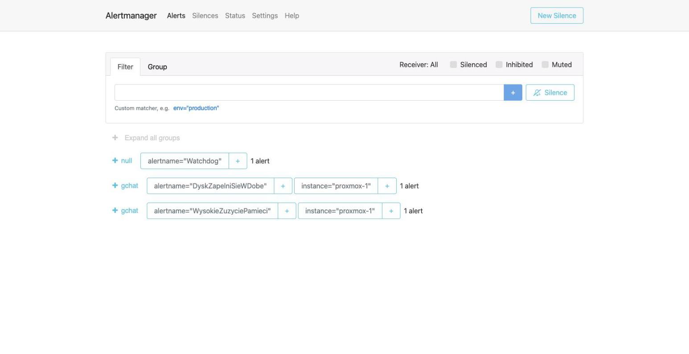
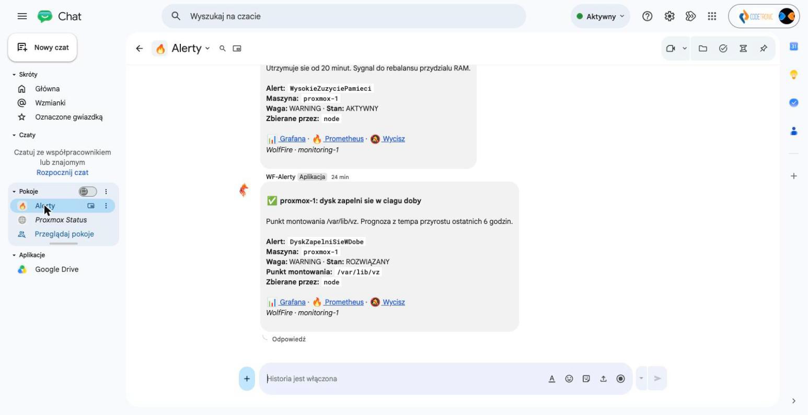

Alert Manager - dowody
========================

- [X] Uruchomiony, w klastrze `ready`
- [X] Powiązany z Prometheusem (reguły alertów faktycznie tam trafiają)
- [X] Skonfigurowany odbiorca (Google Chat przez `calert`)

## Dowody zebrane na żywo (2026-08-05)

Status API:

```
$ curl -s 10.0.120.20:9093/api/v2/status | jq '{cluster: .cluster.status, config: .config.original | length}'
{"cluster": "ready", "config": 1293}
```

Skonfigurowany odbiorca - webhook, nie e-mail:

```
$ curl -s 10.0.120.20:9093/api/v2/status | jq -r '.config.original' | grep -A2 'receivers:'
receivers:
- name: gchat
  webhook_configs:
```

Reguła `Watchdog` faktycznie `firing` w Prometheusie (dowód, że ścieżka
Prometheus -> Alertmanager żyje end-to-end, nie tylko że oba procesy działają
osobno) - zob. [prometheus.md](prometheus.md).

Kontener w stosie:

```
$ ssh wf-monitoring-1 'sudo docker compose -f /opt/monitoring/compose.yml ps alertmanager calert'
NAME           IMAGE                            STATUS
alertmanager   prom/alertmanager:v0.28.0        Up 43 minutes
calert         ghcr.io/mr-karan/calert:latest   Up 43 minutes
```

## Jak to jest zrobione

| Element | Plik |
|---|---|
| Konfiguracja Alertmanagera (odbiorcy, trasowanie) | [ansible/roles/monitoring/templates/](../../ansible/roles/monitoring/templates/) - plik `alertmanager.yml.j2` |
| Reguły, które trafiają do Alertmanagera | [ansible/roles/monitoring/templates/alerts.yml.j2](../../ansible/roles/monitoring/templates/alerts.yml.j2) (ewaluowane przez Prometheusa) |
| Tłumacz webhooka na Google Chat (`calert`) | ten sam Compose - Alertmanager nie mówi natywnie formatem Google Chat, `calert` pośredniczy |

## Świadome decyzje / ograniczenia

- **`calert` jako pośrednik** - Alertmanager wysyła standardowy webhook,
  `calert` tłumaczy go na format karty Google Chat; bez tego kroku
  powiadomienia byłyby czystym, nieczytelnym JSON-em.
- **Ten sam kanał (Google Chat)** jest używany zarówno przez Alertmanager
  (infrastruktura/aplikacja z monitoringu), jak i przez krok `notify` w CD
  aplikacji (zob. [cd.md](cd.md)) - jedno miejsce do sprawdzenia w razie
  awarii, zamiast rozproszonych kanałów.
- **15 reguł alertów pokrywa**: dostępność aplikacji/bazy/Redis, limity
  połączeń Postgresa, dostępność maszyn i eksporterów, restarty/zatrzymania
  kontenerów, miejsce na dysku (w tym prognozę „zapełni się w dobę”),
  zużycie pamięci/CPU i limit pamięci Redisa - nie tylko przykładowa
  pojedyncza reguła.

## Kanał e-mail (AWS SNS) - dodany 2026-08-05

Obok Google Chat alerty warning/critical idą równolegle na e-mail
(`mateusz.serwinowski@gmail.com`) przez AWS SNS - trasa z `continue: true`
w `alertmanager.yml.j2`, natywne `sns_configs` Alertmanagera.

- Infrastruktura w Terraformie (`terraform/bootstrap/sns.tf`): temat
  `wolffire-alerts`, subskrypcja e-mail, dedykowany user IAM
  `wolffire-alertmanager` z samym `sns:Publish` na ten jeden temat.
- Klucze IAM w SOPS (`alertmanager_sns_*`), ARN tematu w
  `group_vars/observability/main.yml`.
- Dowód na żywo: alert testowy `TestKanaluEmail` (amtool) dostarczony -
  metryki CloudWatch tematu: `NumberOfMessagesPublished: 2`,
  `NumberOfNotificationsDelivered: 1`; skrzynka dostała `[FIRING]`
  i po wygaśnięciu `[RESOLVED]` (`send_resolved: true`).
- Wybór SNS zamiast własnego MTA/SES: brak walki z reputacją IP i filtrami,
  a domena celowo deklaruje "brak poczty" (null MX RFC 7505, SPF `-all`,
  DMARC `reject` - patrz moduł `cloudflare/dns`).

Zrzut do zrobienia: **alertmanager-email-sns.png** - mail `[FIRING]
TestKanaluEmail` w skrzynce Gmail.

## Zrzuty ekranu




Related evidence: [prometheus.md](prometheus.md), [cd.md](cd.md).
