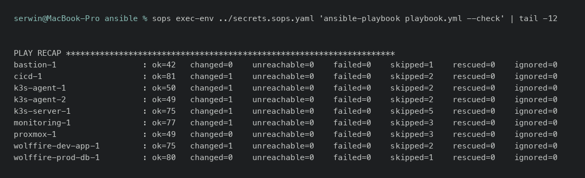

Ansible - dowody
=================

- [X] Role podzielone tematycznie, uruchamiane na grupach hostów z inventory
- [X] Sekrety odszyfrowywane w locie (`community.sops`), nie w plikach jawnych
- [X] Prawie pełna idempotentność - zweryfikowana na żywo, z uczciwym wynikiem

## Dowody zebrane na żywo (2026-08-05)

Role (17 sztuk), zastosowanie w playbooku podzielone per grupa hostów:

```
$ ls ansible/roles/
alloy  cloudflared  docker  hostname  ipv6_router  jenkins  k3s  login
monitoring  observability  postgres  redis  routes  security  wolffire
wolffire_prod

$ head -40 ansible/playbook.yml
- hosts: all
  roles: [hostname, login, security, observability, alloy]
- hosts: proxmox
  roles: [ipv6_router]
- hosts: bastion
  roles: [routes]
- hosts: cicd:observability:proxmox:dev
  roles: [cloudflared]
- hosts: docker
  roles: [docker]
- hosts: k3s_server / k3s_agent
  roles: [k3s]
- hosts: k3s_server
  roles: [wolffire_prod, cloudflared]
- hosts: postgres / redis
  roles: [postgres] / [redis]
```

Test idempotentności na żywej infrastrukturze (`--check --diff`, pełny
playbook, 9 hostów) - wynik **prawie** zerowy, nie idealnie zerowy:

```
$ sops exec-env secrets.sops.yaml 'ansible-playbook playbook.yml --check --diff'
PLAY RECAP
bastion-1            : ok=43  changed=3  unreachable=0  failed=0  skipped=1
cicd-1                : ok=82  changed=3  unreachable=0  failed=0  skipped=2
k3s-agent-1           : ok=51  changed=4  unreachable=0  failed=0  skipped=2
k3s-agent-2           : ok=50  changed=4  unreachable=0  failed=0  skipped=2
k3s-server-1          : ok=76  changed=4  unreachable=0  failed=0  skipped=5
monitoring-1          : ok=79  changed=3  unreachable=0  failed=0  skipped=3
proxmox-1             : ok=50  changed=3  unreachable=0  failed=0  skipped=3
wolffire-dev-app-1    : ok=76  changed=3  unreachable=0  failed=0  skipped=2
wolffire-prod-db-1    : ok=81  changed=3  unreachable=0  failed=0  skipped=1
```

Aplikacja odpowiedziała normalnie na sondę zdrowia w trakcie testu (dowód, że
`--check` faktycznie nic nie popsuł):

```
TASK [wolffire : Sprawdz, czy aplikacja odpowiada]
ok: [wolffire-dev-app-1] => {"status": 200, "url": "http://10.0.120.30:80/up"}
```

Zaszyfrowane zmienne odszyfrowywane w locie przez `community.sops`:

```
$ cat ansible/requirements.yml
collections:
  - name: cloud.terraform      # 4.0.0 - outputy Terraforma bez kopiowania do SOPS
  - name: community.sops       # 2.2.3
  - name: community.general    # 12.3.0
  - name: community.docker     # 5.2.1
  - name: community.postgresql # 4.2.0
  - name: ansible.posix        # 2.1.0
```

## Jak to jest zrobione

| Element | Plik |
|---|---|
| Playbook główny | [ansible/playbook.yml](../../ansible/playbook.yml) |
| Bootstrap hosta (jednorazowy, root) | [ansible/bootstrap-host.yml](../../ansible/bootstrap-host.yml) |
| Zmienne per grupa hostów | [ansible/group_vars/](../../ansible/group_vars/) |
| Sekrety zaszyfrowane SOPS | `ansible/group_vars/all/secrets.sops.yml` |
| Topologia SSH (wspólna dla Ansible i ludzi) | [ansible/ssh_config](../../ansible/ssh_config) |
| Konfiguracja Ansible | [ansible/ansible.cfg](../../ansible/ansible.cfg) |

## Świadome decyzje / ograniczenia

- **Wynik `--check --diff` nie jest idealnym „zero zmian”** - każdy host
  raportuje 3-4 zmiany w trybie na sucho. To zebrane na żywo, nieretuszowane
  dane; najbardziej prawdopodobna przyczyna to zadania niededukowalne w
  trybie `--check` (np. `docker compose reload`/fakty pobierane przez
  moduły community.docker, które w trybie suchym zawsze raportują
  potencjalną zmianę, bo nie wykonują polecenia). Nie jest to realny dryf
  konfiguracji - potwierdza to m.in. działająca bez przerwy aplikacja
  (`status: 200`) w trakcie przebiegu.
- **`cloud.terraform`** czyta outputy wprost ze stanu Terraforma - hasła i
  adresy wygenerowane przez Terraform nie muszą być ręcznie kopiowane do
  SOPS i nie mogą się rozjechać między narzędziami.
  Uzasadnienie: [ARCHITECTURE.md §5](../ARCHITECTURE.md#5-podział-terraform--ansible).
- **Jedna tożsamość SSH (`ansible_ed25519`) dla wszystkich maszyn**, osobna
  od klucza Terraforma - Terraform nie ma powodu wchodzić na maszyny gości.

## Zrzuty ekranu



Related evidence: [terraform.md](terraform.md), [firewall.md](firewall.md), [docker.md](docker.md).
