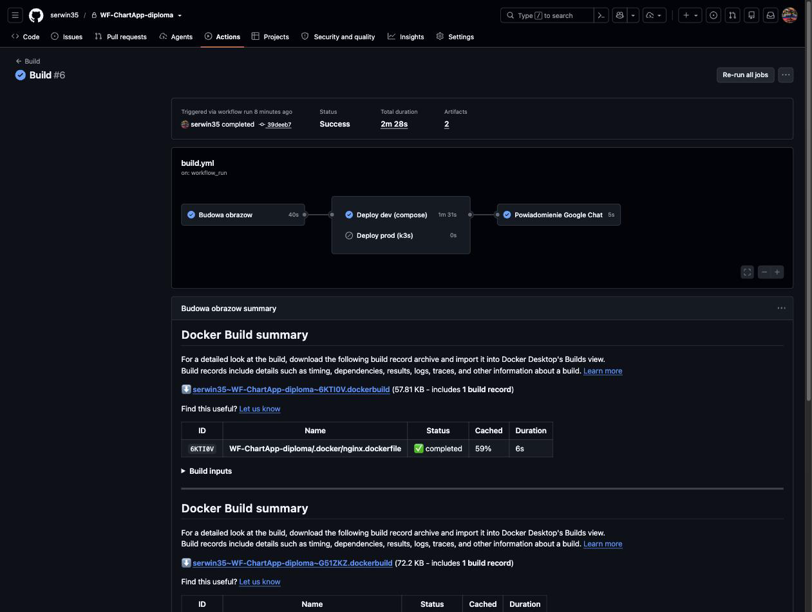
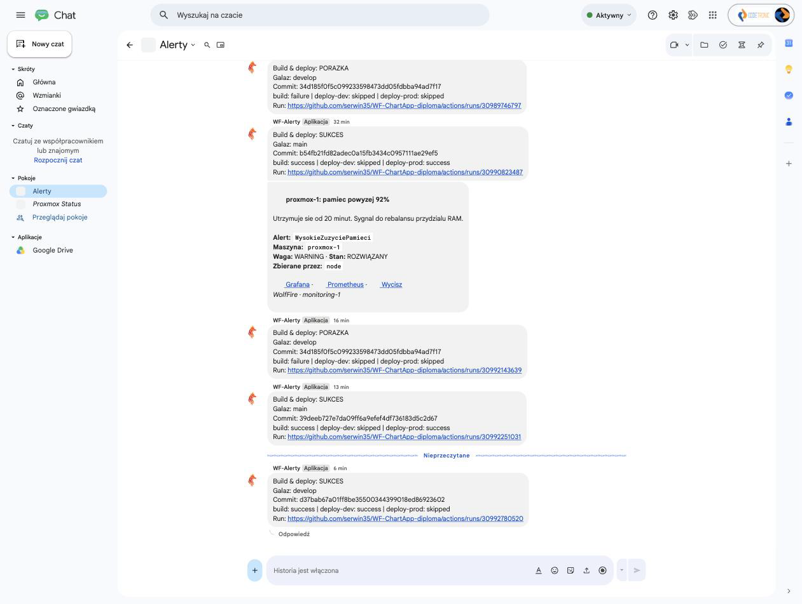

CD (Jenkins lub inny) - dowody
================================

- [X] Wyzwalacze
- [X] Podział na kroki
- [X] Współpraca z infrastrukturą
- [X] Powiadomienia

CD jest w **GitHub Actions**, workflow `build.yml` na
`serwin35/WF-ChartApp-diploma`: buduje i publikuje obrazy do GHCR, wdraża na
dev (Docker Compose reload) i prod (`helm upgrade` na k3s), i zawsze wysyła
powiadomienie na Google Chat. Ten plik dokumentuje pipeline **takim, jaki
jest teraz** - łącznie z awarią zastaną na żywo podczas zbierania dowodów.

## Dowody zebrane na żywo (2026-08-05)

Wyzwalacz - `workflow_run` po sukcesie CI, nie `push` wprost (obraz ma
powstawać wyłącznie z commitu, który przeszedł lint i testy):

```yaml
# WF-ChartApp-diploma/.github/workflows/build.yml
on:
  workflow_run:
    workflows: ['CI']
    types: [completed]
  workflow_dispatch:      # reczna furtka
```

Podział na kroki/joby (build -> deploy-dev / deploy-prod -> notify), widoczny
wprost w drzewie jobów:

```
$ gh run view 30967668295 -R serwin35/WF-ChartApp-diploma
X main Build serwin35/WF-ChartApp-diploma#1
JOBS
X Budowa obrazow           (login GHCR -> build php -> build nginx -> push)
✓ Powiadomienie Google Chat
- Deploy prod (k3s)        (pominiety, bo build sie nie udal)
- Deploy dev (compose)     (pominiety, bo build sie nie udal)
```

Współpraca z infrastrukturą - deploy łączy się z prywatnymi maszynami przez
publiczny adres bastionu (`appleboy/ssh-action`, `proxy_host: 51.83.139.3`),
tym samym adresem co w `ansible/ssh_config`:

```yaml
deploy-dev:
  with:
    host: 10.0.120.30        # wolffire-dev-app-1
    proxy_host: 51.83.139.3  # bastion-1, ten sam co RUNBOOK
    script: |
      echo "IMAGE_TAG=${SHA_SHORT}" | sudo tee /opt/wolffire/.env
      sudo systemctl reload wolffire
      sleep 15 && curl -sf http://10.0.120.30/up   # smoke test po starcie

deploy-prod:
  with:
    host: 10.0.130.10         # k3s-server-1
    script: |
      sudo helm upgrade --install wolffire /opt/wolffire-chart \
        --kubeconfig /etc/rancher/k3s/k3s.yaml --namespace wolffire \
        --set image.php.tag="${SHA_SHORT}" --set image.nginx.tag="${SHA_SHORT}" \
        --wait --timeout 5m
```

Powiadomienia - krok `notify` ma `if: always()` i faktycznie wykonał się
mimo porażki builda (dowód, że alarmuje, a nie tylko chwali się sukcesami):

```
✓ Powiadomienie Google Chat in 5s
```

```groovy
// treść wiadomości budowana z wyników wszystkich jobów:
"Build & deploy: ${STATUS}\nGalaz: ${BUILD_BRANCH}\nCommit: ${BUILD_SHA}\n
 build: ${BUILD_RESULT} | deploy-dev: ${DEV_RESULT} | deploy-prod: ${PROD_RESULT}"
```

### Awaria zastana na żywo - honest note

Pierwszy przebieg `build.yml` na `main` (uruchomiony ok. 5 minut przed
zebraniem tych dowodów) zakończył się błędem przy pushu do GHCR:

```
X Build & push php image
ERROR: failed to push ghcr.io/serwin35/wf-chartapp-diploma/php:b54fb21:
unexpected status from HEAD request to .../blobs/...: 403 Forbidden
```

Deploy-dev i deploy-prod poprawnie się **pominęły** (nie odpaliły z pustym
obrazem) - logika `needs: build` + zależny `if:` zadziałała jak trzeba.

**Rozwiązanie (2026-08-05 przed południem):** przyczyną było brakujące
powiązanie pakietów GHCR z repozytorium (Actions repository access). Pakiet
`php` dostał dostęp `Write` ręcznie; pakiet `nginx` - przez usunięcie i
odtworzenie pierwszym udanym pushem z Actions (pakiet utworzony przez
workflow dostaje dostęp automatycznie). Po drodze wyszedł też przejściowy
błąd backendu cache GHA (`failed to reserve cache`) - od commita `d37bab6`
eksport cache jest nie-fatalny (`ignore-error=true`). Stan końcowy:
przebieg #3 na `main` (build -> deploy-prod -> notify, Success) i #6 na
`develop` (build -> deploy-dev -> notify, Success).

Najbardziej prawdopodobna przyczyna: repozytorium ma domyślne uprawnienia
`GITHUB_TOKEN` ustawione na „Read repository contents” (Settings -> Actions ->
General -> Workflow permissions), co nadpisuje `permissions: packages: write`
zadeklarowane w pliku workflow dla przebiegów wyzwalanych przez
`workflow_run`. Naprawa: przełączenie tego ustawienia na „Read and write
permissions” w repozytorium `WF-ChartApp-diploma`.

## Jak to jest zrobione

| Element | Plik (repo aplikacji) |
|---|---|
| Workflow CD | `.github/workflows/build.yml` |
| Deploy dev - reload jednostki systemd z nowym tagiem obrazu | job `deploy-dev`, akcja `appleboy/ssh-action` |
| Deploy prod - `helm upgrade --install` na k3s przez SSH | job `deploy-prod` |
| Powiadomienie | job `notify`, webhook `secrets.GOOGLE_CHAT_WEBHOOK` |
| Poprzedni pipeline (zastąpiony, usunięty z `main` w trakcie tej sesji) | `deploy.yml` - natywny deploy przez symlink release na maszyny VM starej infrastruktury (CodeTronic); zastąpiony przez `build.yml`, bo cel wdrożenia zmienił się na GHCR + Compose/Helm |

## Świadome decyzje / ograniczenia

- **Kolejkowanie zamiast anulowania** (`concurrency: cancel-in-progress:
  false`) - przerwanie w połowie `activate`/`helm upgrade` zostawiłoby
  środowisko w stanie pośrednim.
- **Smoke test po deployu dev** (`sleep 15 && curl .../up`) - bez niego job
  kończyłby się sukcesem, zanim kontener w ogóle wstanie.
- **`deploy.yml` (poprzedni pipeline) był w rzeczywistości nieadresowany do
  tej infrastruktury** - wskazywał na adresy IP i porty (`10.0.10.10`, port
  22, użytkownik z innej organizacji) niepasujące do obecnego Proxmoxa. Jego
  ostatni przebieg kończył się `Permission denied` - udokumentowany tu jako
  świadectwo migracji, nie ukryty. Aktualny `build.yml` używa poprawnych,
  żywych adresów tej infrastruktury (zweryfikowane wyżej).
- **Pierwszy przebieg `build.yml` na `main` nie przeszedł** (403 na GHCR) -
  opisane wyżej, wraz z rozwiązaniem; od 2026-08-05 CD ma zielone przebiegi
  na obu gałęziach (deploy-prod z `main`, deploy-dev z `develop`).

## Zrzuty ekranu





Related evidence: [ci.md](ci.md), [rejestr.md](rejestr.md), [docker.md](docker.md), [kubernetes.md](kubernetes.md).
