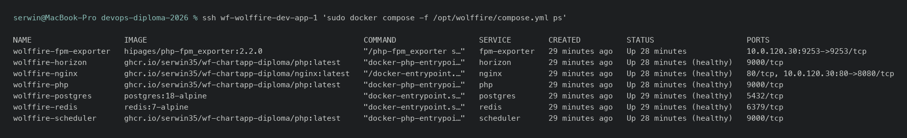
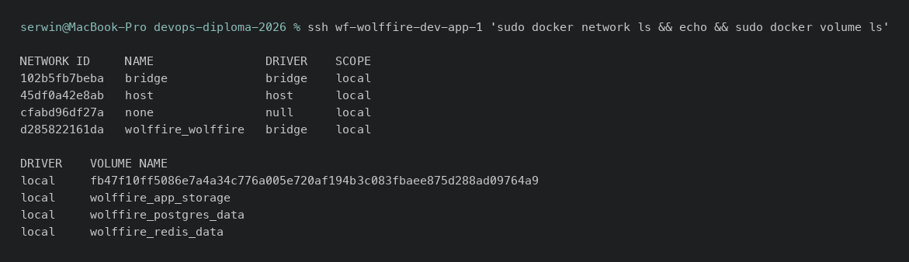

Docker - dowody
================

- [X] Obrazy
- [X] Kontenery
- [X] Sieci
- [X] Wolumeny

Środowisko dev (`wolffire-dev-app-1`) uruchamia całą aplikację przez Docker
Compose - celowo, żeby obrazy/sieci/wolumeny pozostały widoczne wprost,
zamiast schować się za abstrakcjami Kubernetesa (uzasadnienie w
[ARCHITECTURE.md §6](../ARCHITECTURE.md#6-dlaczego-dwa-środowiska-różnymi-technologiami)).
Monitoring i Jenkins też stoją w Compose.

## Dowody zebrane na żywo (2026-08-05)

Kontenery aplikacji (dev):

```
$ ssh wf-wolffire-dev-app-1 'sudo docker compose -f /opt/wolffire/compose.yml ps'
NAME                    IMAGE                                               SERVICE        STATUS
wolffire-fpm-exporter   hipages/php-fpm_exporter:2.2.0                      fpm-exporter   Up 32 minutes
wolffire-horizon        ghcr.io/serwin35/wf-chartapp-diploma/php:latest     horizon        Up 32 minutes (healthy)
wolffire-nginx          ghcr.io/serwin35/wf-chartapp-diploma/nginx:latest   nginx          Up 32 minutes (healthy)
wolffire-php            ghcr.io/serwin35/wf-chartapp-diploma/php:latest     php            Up 32 minutes (healthy)
wolffire-postgres       postgres:18-alpine                                  postgres       Up 32 minutes (healthy)
wolffire-redis          redis:7-alpine                                      redis          Up 32 minutes (healthy)
wolffire-scheduler      ghcr.io/serwin35/wf-chartapp-diploma/php:latest     scheduler      Up 32 minutes (healthy)
```

Sieci - sieć dedykowana per stos, nie `bridge` domyślny:

```
$ ssh wf-wolffire-dev-app-1 'sudo docker network ls'
NETWORK ID     NAME                DRIVER    SCOPE
102b5fb7beba   bridge              bridge    local
45df0a42e8ab   host                host      local
cfabd96df27a   none                null      local
70632c26f0b9   wolffire_wolffire   bridge    local
```

Wolumeny nazwane, trwałe (baza, Redis, storage aplikacji):

```
$ ssh wf-wolffire-dev-app-1 'sudo docker volume ls'
DRIVER    VOLUME NAME
local     wolffire_app_storage
local     wolffire_postgres_data
local     wolffire_redis_data
local     fb47f10ff5086e7a4a34c776a005e720af194b3c083fbaee875d288ad09764a9
```

Monitoring (osobny stos Compose na `monitoring-1`):

```
$ ssh wf-monitoring-1 'sudo docker compose -f /opt/monitoring/compose.yml ps'
NAME           IMAGE                       SERVICE        STATUS
alertmanager   prom/alertmanager:v0.28.0   alertmanager   Up 43 minutes
calert         ghcr.io/mr-karan/calert     calert         Up 43 minutes
grafana        grafana/grafana:11.5.1      grafana        Up 43 minutes
loki           grafana/loki:3.3.2          loki           Up 43 minutes
prometheus     prom/prometheus:v3.1.0      prometheus     Up 43 minutes
```

Jenkins (`cicd-1`) - obraz budowany lokalnie z Dockerfile, nie z rejestru:

```
$ ssh wf-cicd-1 'sudo docker ps --format "table {{.Names}}\t{{.Image}}\t{{.Status}}"'
NAMES      IMAGE                              STATUS
jenkins    wolffire/jenkins:7e003f8a8f47      Up 48 minutes
cadvisor   gcr.io/cadvisor/cadvisor:v0.55.1   Up 2 hours (healthy)
```

## Jak to jest zrobione

| Element | Plik |
|---|---|
| Compose aplikacji dev (generowany z szablonu) | [ansible/roles/wolffire/templates/](../../ansible/roles/wolffire/templates/) |
| Compose monitoringu | [ansible/roles/monitoring/templates/compose.yml.j2](../../ansible/roles/monitoring/templates/compose.yml.j2) |
| Dockerfile obrazu Jenkinsa (budowany lokalnie) | [ansible/roles/jenkins/templates/Dockerfile.j2](../../ansible/roles/jenkins/templates/Dockerfile.j2) |
| Dockerfile aplikacji (multi-stage: composer/node -> runtime) | `WF-ChartApp-diploma/.docker/{php,nginx}.dockerfile` - repo aplikacji, zob. [rejestr.md](rejestr.md) |
| Rola instalująca silnik Dockera | [ansible/roles/docker/](../../ansible/roles/docker/) |

## Świadome decyzje / ograniczenia

- **Sieć per stos** (`wolffire_wolffire`) zamiast wspólnego `bridge` - izoluje
  kontenery aplikacji od monitoringu uruchomionego na tej samej maszynie.
- **Wolumeny nazwane** (`wolffire_postgres_data`, `wolffire_redis_data`,
  `wolffire_app_storage`) przeżywają `docker compose down` i restart maszyny -
  dane nie giną przy reloadzie usługi.
- **Obraz aplikacji jest jeden, używany w dwóch miejscach**: to samo
  `ghcr.io/.../php:latest` / `.../nginx:latest` co na produkcyjnym k3s (zob.
  [kubernetes.md](kubernetes.md)) - dev Compose i prod Helm różnią się
  sposobem wdrożenia, nie artefaktem.
- **`docker compose ps` na dev jest wywoływane przez jednostkę systemd**
  (`wolffire.service`), nie ręcznie - `ExecStart=/usr/bin/docker compose up
  -d`, `ExecReload` robi `pull` + `up -d` przy aktualizacji tagu obrazu (zob.
  [cd.md](cd.md)).

## Zrzuty ekranu




Related evidence: [rejestr.md](rejestr.md), [cd.md](cd.md), [kubernetes.md](kubernetes.md).
