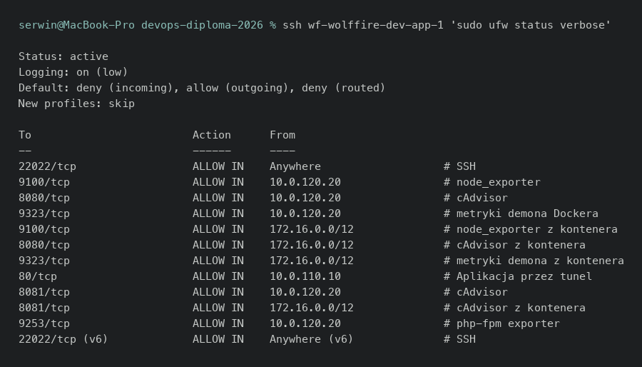

Ubuntu (lub inny Debian-based) - Firewall - dowody
===================================================

- [X] Firewall

Wszystkie osiem maszyn to Ubuntu 24.04 LTS, każda z UFW aktywnym i domyślną
polityką odrzucania ruchu przychodzącego, plus regułami źródłowymi (nie
`allow any`).

## Dowody zebrane na żywo (2026-08-05)

```
$ ssh wf-wolffire-dev-app-1 'sudo ufw status verbose'
Status: active
Default: deny (incoming), allow (outgoing), deny (routed)
22022/tcp   ALLOW IN  Anywhere               # SSH
9100/tcp    ALLOW IN  10.0.120.20            # node_exporter
8080/tcp    ALLOW IN  10.0.120.20            # cAdvisor
80/tcp      ALLOW IN  10.0.110.10            # Aplikacja przez tunel (tylko z bastionu)
9253/tcp    ALLOW IN  10.0.120.20            # php-fpm exporter
...

$ ssh wf-monitoring-1 'sudo ufw status verbose'
Status: active
Default: deny (incoming), allow (outgoing), deny (routed)
3000/tcp    ALLOW IN  10.0.110.10            # Grafana - tylko przez bastion
9090/tcp    ALLOW IN  10.0.110.10            # Prometheus
9093/tcp    ALLOW IN  10.0.110.10            # Alertmanager
3100/tcp    ALLOW IN  10.0.0.0/16            # Loki - push z Alloy (wszystkie segmenty)
...

$ ssh wf-k3s-server-1 'sudo ufw status verbose'
Status: active
Default: deny (incoming), allow (outgoing), allow (routed)
6443/tcp    ALLOW IN  10.0.120.10             # API dla wdrozen z CI (runner)
6443/tcp    ALLOW IN  10.0.0.0/16             # API klastra k3s
10250/tcp   ALLOW IN  10.0.130.0/24           # kubelet
8472/udp    ALLOW IN  10.0.130.0/24           # flannel VXLAN
80/tcp, 443/tcp ALLOW IN 10.0.110.10          # Traefik z bastionu

$ ssh wf-wolffire-prod-db-1 'sudo ufw status verbose'
Status: active
Default: deny (incoming), allow (outgoing), disabled (routed)
5432/tcp    ALLOW IN  10.0.130.0/24           # Postgres z klastra k3s
5432/tcp    ALLOW IN  10.0.120.10             # Postgres dla kopii z CI/CD (Jenkins pg_dump)
6379/tcp    ALLOW IN  10.0.130.0/24           # Redis z klastra

$ ssh wf-bastion-1 'sudo ufw status verbose'
Status: active
Default: deny (incoming), allow (outgoing), disabled (routed)
22022/tcp   ALLOW IN  Anywhere                # jedyny publiczny port całej infrastruktury
```

Test odwrotny (izolacja segmentów, potwierdzony automatycznie przez
`scripts/smoke-test.sh`, sekcja 6):

```
✓ monitoring-1 NIE ma dostepu do 10.0.140.10:5432 (pakiety odrzucane po cichu)
```

Na hypervisorze UFW jest celowo `inactive` - tam firewall opisuje Terraform
przez `pve-firewall` (patrz [vm.md](vm.md)):

```
$ ssh wf-proxmox-1 'sudo ufw status'
Status: inactive
```

## Jak to jest zrobione

| Element | Plik |
|---|---|
| Rola Ansible `security` - UFW, fail2ban, unattended-upgrades | [ansible/roles/security/](../../ansible/roles/security/) |
| Reguły per-maszyna (źródło, port, komentarz) | `group_vars/*/main.yml` - każda grupa hostów (`dev`, `observability`, `k3s_server`, `postgres`…) deklaruje własną listę portów i dozwolonych źródeł |
| Zastosowanie w playbooku | [ansible/playbook.yml](../../ansible/playbook.yml) - rola `security` uruchamiana na `hosts: all` |

## Świadome decyzje / ograniczenia

- **Dwie warstwy firewalla celowo się pokrywają** - Proxmox (Terraform) i UFW
  (Ansible) egzekwują tę samą politykę „SSH tylko z bastionu” niezależnie.
  Błąd w jednej warstwie nie otwiera maszyny (opisane w
  [ARCHITECTURE.md §3](../ARCHITECTURE.md#3-bezpieczeństwo--trzy-warstwy)).
- **Porty eksporterów (9100, 9187, 9121, 8080…) są otwarte wyłącznie dla
  adresu Prometheusa** (10.0.120.20), nie dla całego segmentu `apps` - widać
  to w regułach powyżej.
- **UFW na hypervisorze musi być `inactive`.** Dwa niezależne firewalle na
  tym samym nftables (UFW + `pve-firewall`) wchodzą sobie w drogę, a
  domyślna polityka `FORWARD` w UFW blokuje routing między segmentami SDN -
  udokumentowane w `docs/RUNBOOK.md §6` jako częsty błąd.

## Zrzuty ekranu



Related evidence: [vm.md](vm.md), [terraform.md](terraform.md).
