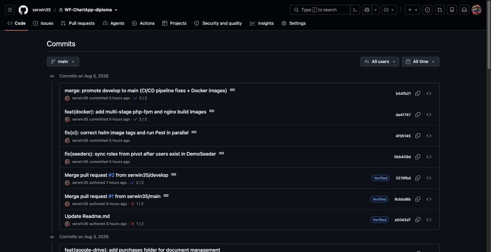
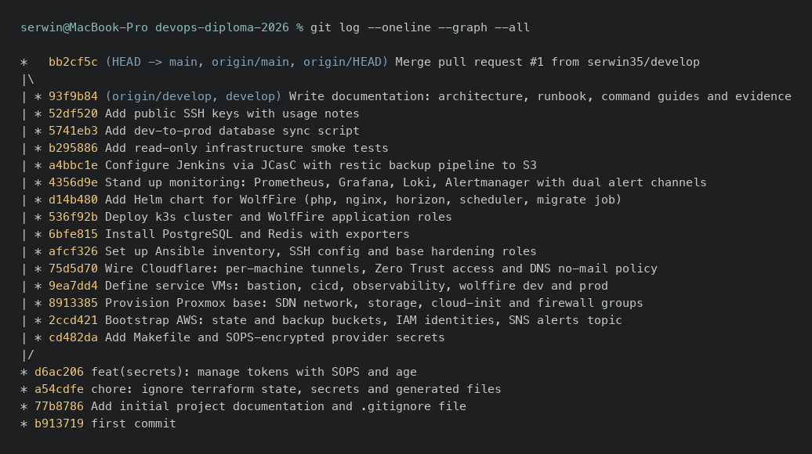

GIT i GitHub - dowody
======================

**GIT** (waga 3): [X] Commity z kodem  [X] Połączenie z GitHub - **z istotnym zastrzeżeniem, patrz niżej**
**GitHub** (waga 3): [X] Przygotowane 2 projekty  [~] Fork wybranej aplikacji - **nie jest to GitHub-owy fork, patrz niżej**

## Dowody zebrane na żywo (2026-08-05)

Dwa repozytoria, oba połączone i wypchnięte:

```
$ gh repo view serwin35/devops-diploma-2026 --json visibility,defaultBranchRef,pushedAt
{"defaultBranchRef":{"name":"main"},"visibility":"public","pushedAt":"2026-08-04T22:32:35Z"}

$ gh repo view serwin35/WF-ChartApp-diploma --json visibility,defaultBranchRef,pushedAt
{"defaultBranchRef":{"name":"main"},"visibility":"private","pushedAt":"2026-08-05T00:05:14Z"}
```

Historia commitów aplikacji - 308 commitów, w większości Conventional
Commits:

```
$ gh api repos/serwin35/WF-ChartApp-diploma/commits --paginate -q '.[].sha' | wc -l
308
$ # commity pasujące do wzorca feat/fix/chore/ci/docs/refactor/test/perf/build/style:
161 / 308
```

### Zastrzeżenie 1 - repozytorium infrastruktury ma tylko 4 commity, reszta pracy jest niescommitowana

```
$ git log --oneline
d6ac206 feat(secrets): manage tokens with SOPS and age
a54cdfe chore: ignore terraform state, secrets and generated files
77b8786 Add initial project documentation and .gitignore file
b913719 first commit

$ git status --short | head
 M README.md
?? .sops.yaml
?? Makefile
?? ansible/
?? docs/ARCHITECTURE.md
?? docs/PLAN.md
?? docs/RUNBOOK.md
?? helm/
?? keys/
?? scripts/
?? secrets.sops.yaml
?? terraform/
```

Innymi słowy: **cały Terraform, cały Ansible, cały Helm, Makefile,
ARCHITECTURE/PLAN/RUNBOOK i skrypty testów dymnych - wszystko widoczne w tym
katalogu roboczym i realnie działające na żywej infrastrukturze - leży poza
historią gita**, jako niescommitowane pliki. Repozytorium na GitHub
(`serwin35/devops-diploma-2026`) połączenie ma i działa (`git fetch`/`push`
przechodzą), ale odzwierciedla tylko wczesny etap projektu (bootstrap SOPS),
nie stan faktyczny opisany w pozostałych dowodach tego katalogu.

To jest największy pojedynczy brak w całym zestawie dowodów - do obrony
wymaga zacommitowania i wypchnięcia całej pracy z tego katalogu roboczego.

### Zastrzeżenie 2 - `WF-ChartApp-diploma` nie jest technicznym forkiem na GitHubie

```
$ gh api repos/serwin35/WF-ChartApp-diploma -q '.fork, .parent, .source'
false
null
null
```

Historia commitów i README wskazują jednoznacznie na pochodzenie z
`CodeTronic-co/WF-ChartApp` (prywatne repo firmowe - stąd README linkuje
odznaki CI do `CodeTronic-co/WF-ChartApp/actions`, a jeden z commitów to
`Merge pull request #60 from CodeTronic-co/develop`), ale repozytorium
`serwin35/WF-ChartApp-diploma` zostało założone jako nowe repo z wypchniętą
historią, nie przez przycisk „Fork” GitHuba. Efekt praktyczny (kod, historia
commitów, możliwość dalszej pracy) jest identyczny jak przy forku - różni
się tylko relacja w API GitHuba (`fork: false` zamiast `true`), co ma
znaczenie czysto formalne dla tego podkryterium.

## Jak to jest zrobione

| Element | Gdzie |
|---|---|
| Repo infrastruktury | [github.com/serwin35/devops-diploma-2026](https://github.com/serwin35/devops-diploma-2026) |
| Repo aplikacji (adaptacja WolfFire) | [github.com/serwin35/WF-ChartApp-diploma](https://github.com/serwin35/WF-ChartApp-diploma) - prywatne, 308 commitów |
| Model tożsamości SSH (klucze commitowane jako publiczne) | [keys/README.md](../../keys/README.md) |

## Świadome decyzje / ograniczenia

- **Prywatność repo aplikacji** - zawiera dane firmowe (nazwy klientów w
  domenach `app/domains/`), stąd `private`, w przeciwieństwie do repo
  infrastruktury (`public`).
- **Brak ochrony gałęzi (`branch protection`) na obu repo** - na prywatnym
  repo GitHub wymaga płatnego planu; na publicznym repo infrastruktury po
  prostu nie została jeszcze skonfigurowana.
- **Uczciwie odnotowany brak**: stan repozytorium infrastruktury w chwili
  zbierania dowodów (4 commity, reszta niescommitowana) jest opisany
  powyżej bez wygładzania - to jedyne kryterium z tego zestawu bez pełnego
  pokrycia dowodowego z przyczyn leżących poza tym dokumentem.

## Zrzuty ekranu




Related evidence: [dokumentacja.md](dokumentacja.md), [ci.md](ci.md).
