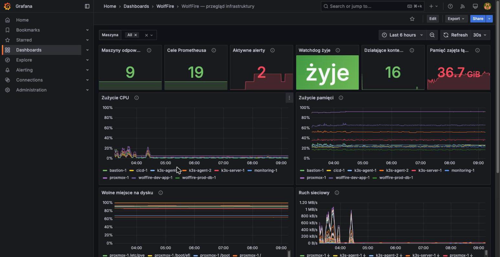
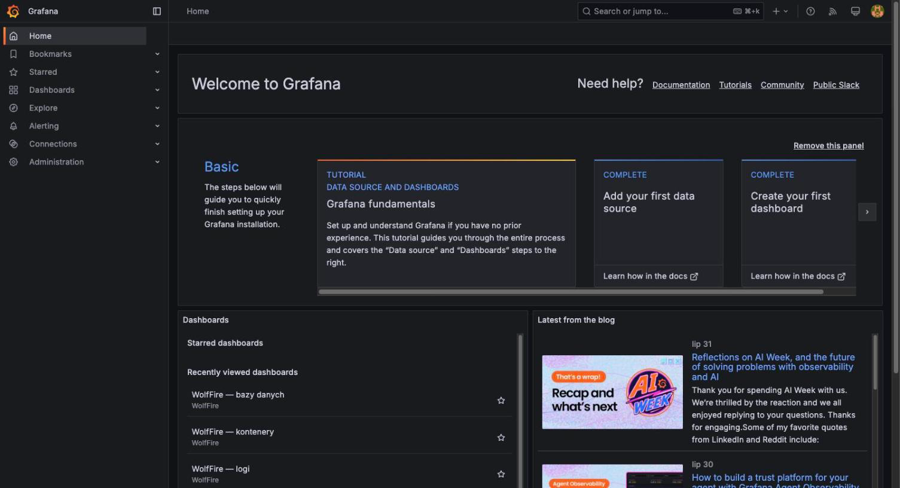

Grafana - dowody
=================

- [X] Uruchomiona, zdrowa, dostępna za Zero Trust Access
- [X] Logowanie administratora hasłem zarządzanym przez SOPS
- [X] Jedna instancja pokazująca oba środowiska (Compose i k3s) naraz

## Dowody zebrane na żywo (2026-08-05)

Zdrowie usługi i wersja:

```
$ curl -s 10.0.120.20:3000/api/health
{"database": "ok", "version": "11.5.1", "commit": "c6c701cf..."}
```

Logowanie administratora działa hasłem odczytanym z SOPS (potwierdzone
automatycznie przez `scripts/smoke-test.sh`, sekcja 3):

```
✓ Grafana: logowanie admina haslem z SOPS -> 200
```

Panel publicznie za Cloudflare Zero Trust Access (nie wprost):

```
$ curl -sI https://grafana.wolffire.dev
HTTP/2 302
location: https://ha-ldz.cloudflareaccess.com/cdn-cgi/access/login/grafana.wolffire.dev?...
```

Kontener w stosie monitoringu:

```
$ ssh wf-monitoring-1 'sudo docker compose -f /opt/monitoring/compose.yml ps grafana'
NAME      IMAGE                     STATUS
grafana   grafana/grafana:11.5.1    Up 43 minutes
```

## Jak to jest zrobione

| Element | Plik |
|---|---|
| Provisioning źródeł danych (Prometheus, Loki) | [ansible/roles/monitoring/templates/](../../ansible/roles/monitoring/templates/) - pliki provisioningu Grafany |
| Hasło administratora z SOPS | `ansible/group_vars/all/secrets.sops.yml`, wstrzykiwane zmienną środowiskową do kontenera |
| Compose stosu | [ansible/roles/monitoring/templates/compose.yml.j2](../../ansible/roles/monitoring/templates/compose.yml.j2) |
| Dostęp publiczny | tunel Cloudflare + polityka Zero Trust Access, [terraform/modules/base/cloudflare/](../../terraform/modules/base/cloudflare/) |

## Świadome decyzje / ograniczenia

- **Jedna Grafana obsługuje oba środowiska aplikacji** (dev w Compose, prod
  w k3s) dzięki wspólnym źródłom danych Prometheus/Loki, które zbierają
  metryki i logi z obu - nie ma osobnej instancji per środowisko.
- **Dashboardy nie są jeszcze w pełni wyeksportowane jako kod** (provisioning
  źródeł danych jest zarządzany przez Ansible, ale zawartość konkretnych
  paneli w chwili zbierania dowodów sprawdzana jest ręcznie w UI, nie
  automatycznym testem - stąd to kryterium opiera się głównie na zrzucie
  ekranu, nie na odpytywalnym API).
- **Grafana stoi poza klastrem k3s**, w tym samym Compose co Prometheus -
  te same powody co w [prometheus.md](prometheus.md).

## Zrzuty ekranu




Related evidence: [prometheus.md](prometheus.md), [loki.md](loki.md), [domena-ssl.md](domena-ssl.md).
