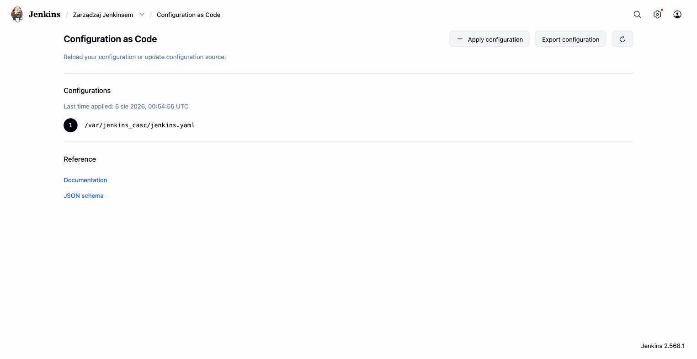
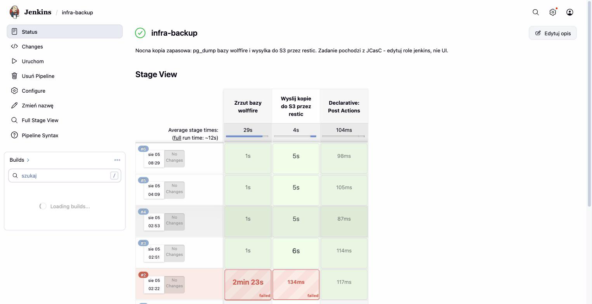

Jenkins Configuration as Code - dowody
========================================

- [X] Cała konfiguracja kontrolera z jednego pliku YAML, renderowanego przez Ansible
- [X] Zadanie (job) zasiane z kodu przez Job DSL, nie klikane w UI
- [X] Harmonogram (`cron`) i poświadczenia zdefiniowane deklaratywnie

## Dowody zebrane na żywo (2026-08-05)

Plik JCasC faktycznie obecny w kontenerze, zgodny z szablonem w repo:

```
$ ssh wf-cicd-1 'sudo docker exec jenkins ls -la /var/jenkins_casc/'
-rw-r--r-- 1 root root 5030 Aug  5 00:54 backup-pipeline.groovy
-rw-r--r-- 1 root root 7451 Aug  5 00:21 jenkins.yaml
```

Zadanie zasiane z Job DSL (nazwa `infra-backup`, nie klikana w UI):

```
$ ssh wf-cicd-1 'sudo docker exec jenkins ls -la /var/jenkins_home/jobs/'
drwxr-xr-x  3 jenkins jenkins  infra-backup

$ sudo docker exec jenkins grep -A2 'spec>' /var/jenkins_home/jobs/infra-backup/config.xml
<spec>H 2 * * *</spec>          <!-- harmonogram: co noc ok. 2:00, z Job DSL -->
```

Cztery przebiegi w historii, budowane wyłącznie z konfiguracji (bez
klikania „Build Now” w UI za pierwszym razem - trigger to `cron`):

```
$ sudo docker exec jenkins ls /var/jenkins_home/jobs/infra-backup/builds/
1  2  3  4  permalinks
```

Treść `jenkins.yaml` (fragment) - realm, autoryzacja, chmura agentów i
poświadczenia zdefiniowane w jednym pliku:

```yaml
jenkins:
  systemMessage: |
    Ta instancja jest skonfigurowana w calosci z kodu (Configuration as Code).
    Zmiany wprowadzone w interfejsie zostana nadpisane przy najblizszym
    restarcie kontenera.
  securityRealm:
    local:
      allowsSignup: false
      users: [{id: "{{ jenkins_admin_user }}", password: "${JENKINS_ADMIN_PASSWORD}"}]
  authorizationStrategy:
    loggedInUsersCanDoAnything: {allowAnonymousRead: false}
credentials:
  system:
    domainCredentials:
      - credentials:
          - usernamePassword: {id: "{{ jenkins_cred_db }}", ...}
          - usernamePassword: {id: "{{ jenkins_cred_restic_s3 }}", ...}
          - string: {id: "{{ jenkins_cred_restic_password }}", ...}
jobs:
  - script: >
      pipelineJob('{{ jenkins_backup_job_name }}') { triggers { cron('{{ jenkins_backup_cron }}') } ... }
```

## Jak to jest zrobione

| Element | Plik |
|---|---|
| Szablon JCasC (jedyne źródło prawdy) | [ansible/roles/jenkins/templates/jenkins.yaml.j2](../../ansible/roles/jenkins/templates/jenkins.yaml.j2) |
| Pipeline zadania backupowego (osobny plik, wczytywany przez Job DSL) | [ansible/roles/jenkins/templates/backup-pipeline.groovy.j2](../../ansible/roles/jenkins/templates/backup-pipeline.groovy.j2) |
| Renderowanie na kontrolerze (SSH + sekrety z SOPS) | [ansible/roles/jenkins/tasks/main.yml](../../ansible/roles/jenkins/tasks/main.yml) |
| Hook zatwierdzający skrypty zasiane przez Job DSL | `ansible/roles/jenkins/templates/approve-seeded-scripts.groovy.j2` |
| Hook łagodzący CSP dla raportów | `ansible/roles/jenkins/templates/relax-report-csp.groovy.j2` |

## Świadome decyzje / ograniczenia

- **Pipeline w osobnym pliku `.groovy`, nie wklejony w YAML** - wielolinijkowe
  polecenia powłoki przechodziłyby przez cztery poziomy cytowania (YAML ->
  Groovy Job DSL -> Groovy pipeline -> shell); osobny plik czyta się jak
  zwykły Jenkinsfile i nie wymaga ręcznych ucieczek znaków.
- **`useScriptSecurity: false`** - skrypt Job DSL pochodzi z tego
  repozytorium i jest wykonywany przez JCasC przy starcie, nie przez
  użytkowników; z włączoną kontrolą skryptów zadanie czekałoby na ręczne
  zatwierdzenie w UI przy każdym starcie kontenera.
- **`sandbox(true)` w definicji pipeline'u mimo zaufanego źródła** - bez
  sandboksa wtyczka `script-security` żądałaby ręcznego zatwierdzenia kodu
  („script not yet approved”); pipeline korzysta wyłącznie ze standardowych
  kroków (`sh`, `withCredentials`, `deleteDir`), więc sandbox go nie
  ogranicza.
- **Wariant `cpsScm`** (pipeline pobierany z repozytorium git) świadomie
  odrzucony - kopia zapasowa ma działać także wtedy, gdy hosting
  repozytorium jest niedostępny.
- **Zero sekretów w `jenkins.yaml`** - plik zawiera tylko identyfikatory
  poświadczeń; wartości wchodzą do kontenera zmiennymi środowiskowymi z
  SOPS przez `compose.yml.j2`.

## Zrzuty ekranu




Related evidence: [jenkins-agenty.md](jenkins-agenty.md), [state-s3.md](state-s3.md), [docker.md](docker.md).
