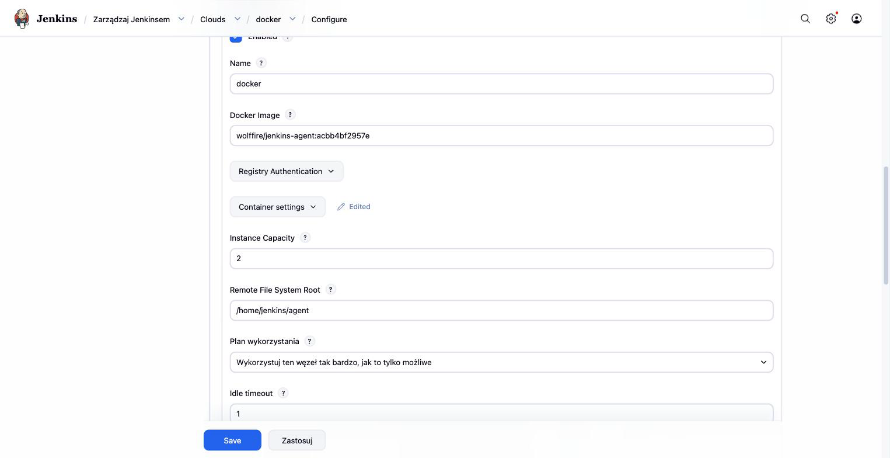
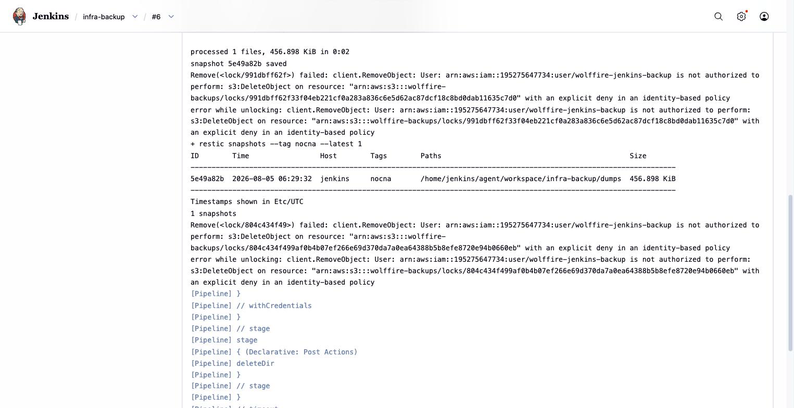

Agenty Jenkins (lub inne runnery) - dowody
============================================

- [X] Agenty jako efemeryczne kontenery Dockera (chmura `docker`, nie stali agenci)
- [X] Realny przebieg zadania na agencie, z historią sukcesów i porażek
- [X] Runner GitHub Actions (drugie narzędzie CI/CD, dla porównania)

## Dowody zebrane na żywo (2026-08-05)

Konfiguracja chmury agentów w Jenkinsie - kontener Dockera per build, obraz
budowany lokalnie (`PULL_NEVER`), bez portu 50000 wystawionego na hosta:

```yaml
# ansible/roles/jenkins/templates/jenkins.yaml.j2
jenkins:
  numExecutors: 0        # kontroler NIC nie wykonuje - tylko agenty
  mode: EXCLUSIVE
  clouds:
    - docker:
        name: docker
        containerCap: {{ jenkins_agent_cap }}
        templates:
          - labelString: "{{ jenkins_agent_label }}"
            pullStrategy: PULL_NEVER
            dockerTemplateBase:
              image: "{{ jenkins_agent_image }}"
              network: jenkins
            remoteFs: "/home/jenkins/agent"
            retentionStrategy:
              idleMinutes: {{ jenkins_agent_idle_minutes }}
```

Historia przebiegów zadania `infra-backup` na tym agencie - widać ewolucję
od porażek do sukcesu (nieretuszowana historia, odczytana bezpośrednio z
plików Jenkinsa przez `docker exec`, bez potrzeby hasła w API):

```
$ ssh wf-cicd-1 'sudo docker exec jenkins ls /var/jenkins_home/jobs/infra-backup/builds/'
1  2  3  4

$ for i in 1 2 3 4; do
    docker exec jenkins grep -E 'result>' /var/jenkins_home/jobs/infra-backup/builds/$i/build.xml
  done
build 1: FAILURE  (22 ms - błąd konfiguracji, szybka porażka)
build 2: FAILURE  (201s)
build 3: SUCCESS  (11s)
build 4: SUCCESS  (13s)
```

Log ostatniego (udanego) przebiegu - agent faktycznie uruchomił kroki
pipeline'u we własnym katalogu roboczym:

```
[Pipeline] sh
+ restic backup --tag nocna --host jenkins dumps
Added to the repository: 457.622 KiB (56.042 KiB stored)
snapshot a1f2d1ce saved
+ restic snapshots --tag nocna --latest 1
ID        Host       Paths
a1f2d1ce  jenkins    /home/jenkins/agent/workspace/infra-backup/dumps
Finished: SUCCESS
```

Agent jest efemeryczny - poza czasem builda w ogóle nie istnieje jako
kontener:

```
$ ssh wf-cicd-1 'sudo docker ps'
NAMES      IMAGE
jenkins    wolffire/jenkins:7e003f8a8f47
cadvisor   gcr.io/cadvisor/cadvisor:v0.55.1
# (brak kontenera agenta - build się skończył, kontener zniknął)
```

## Jak to jest zrobione

| Element | Plik |
|---|---|
| Chmura Dockera + szablon agenta (JCasC) | [ansible/roles/jenkins/templates/jenkins.yaml.j2](../../ansible/roles/jenkins/templates/jenkins.yaml.j2) |
| Obraz agenta (Dockerfile) | [ansible/roles/jenkins/templates/agent-Dockerfile.j2](../../ansible/roles/jenkins/templates/agent-Dockerfile.j2) |
| Gniazdo Dockera zamontowane z hosta | [ansible/roles/jenkins/templates/compose.yml.j2](../../ansible/roles/jenkins/templates/compose.yml.j2) |
| Pipeline, który agent wykonuje | [ansible/roles/jenkins/templates/backup-pipeline.groovy.j2](../../ansible/roles/jenkins/templates/backup-pipeline.groovy.j2) |

## Świadome decyzje / ograniczenia

- **`numExecutors: 0` na kontrolerze** - kontroler ma dostęp do gniazda
  Dockera i własnej konfiguracji, więc kod z zadań nie ma prawa się tam
  wykonywać. Od tego są wyłącznie agenty.
- **`PULL_NEVER`** - obraz agenta powstaje lokalnie na tej maszynie i nie ma
  go w żadnym rejestrze; bez tej flagi wtyczka próbowałaby go ściągnąć z
  Docker Huba i kończyła błędem `pull access denied`.
- **Runner GitHub Actions to *nie* runner self-hosted w tej infrastrukturze**
  - obecny pipeline aplikacji (`ci.yml`, `build.yml`) używa runnerów
  hostowanych przez GitHuba, łącząc się z prywatnymi maszynami dopiero w
  kroku deployu, przez SSH proxy'owane bastionem. To zmiana względem
  wcześniejszej wersji architektury (`ARCHITECTURE.md §8` opisuje runner
  self-hosted „wewnątrz segmentu apps” - już nieaktualne, brak takiego
  runnera zarejestrowanego: `gh api .../actions/runners` zwraca pustą
  listę). Kryterium „agenty Jenkins **lub inne runnery**” jest tu więc
  realizowane przez agenty Dockera Jenkinsa, nie przez runner GitHuba.

## Zrzuty ekranu




Related evidence: [jcasc.md](jcasc.md), [state-s3.md](state-s3.md), [ci.md](ci.md).
