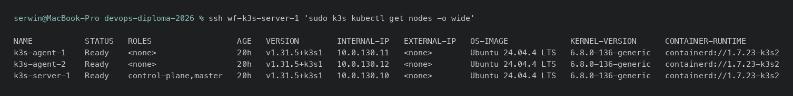
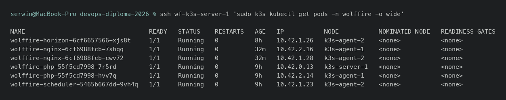

Kubernetes - dowody
====================

- [X] Klaster wielowęzłowy (k3s: 1 control-plane + 2 agentów)
- [X] Aplikacja produkcyjna wdrożona Helmem
- [X] Deployment, Service, Job (migracje)
- [X] Storage (`local-path` PVC - nieużywany celowo, patrz ograniczenia)
- [ ] HorizontalPodAutoscaler - **brak w chartcie, patrz ograniczenia**

## Dowody zebrane na żywo (2026-08-05)

Trzy węzły, wszystkie `Ready`:

```
$ ssh wf-k3s-server-1 'sudo k3s kubectl get nodes -o wide'
NAME           STATUS   ROLES                  VERSION        INTERNAL-IP
k3s-agent-1    Ready    <none>                 v1.31.5+k3s1   10.0.130.11
k3s-agent-2    Ready    <none>                 v1.31.5+k3s1   10.0.130.12
k3s-server-1   Ready    control-plane,master   v1.31.5+k3s1   10.0.130.10
```

Aplikacja rozłożona na wszystkich trzech węzłach:

```
$ sudo k3s kubectl get pods -n wolffire -o wide
wolffire-horizon-75bc98995f-sp2zk    1/1  Running   k3s-agent-2
wolffire-nginx-58db7b9c85-2cgh5      1/1  Running   k3s-agent-1
wolffire-nginx-58db7b9c85-hlgzk      1/1  Running   k3s-agent-2
wolffire-php-5f9b78fcc7-dtzl6        1/1  Running   k3s-server-1
wolffire-php-5f9b78fcc7-rc7z8        1/1  Running   k3s-agent-1
wolffire-scheduler-7598f4f7b7-kphc5  1/1  Running   k3s-server-1
```

Serwisy i control plane systemowy:

```
$ sudo k3s kubectl get svc -A
wolffire      wolffire-nginx   ClusterIP      10.43.56.155   80/TCP
wolffire      wolffire-php     ClusterIP      10.43.26.149   9000/TCP
kube-system   traefik          LoadBalancer   10.43.207.71   10.0.130.10,10.0.130.11,10.0.130.12   80:32536/TCP,443:32359/TCP

$ sudo k3s kubectl get pods -n kube-system
coredns-...                    1/1  Running
helm-install-traefik-crd-...   0/1  Completed
helm-install-traefik-...       0/1  Completed
local-path-provisioner-...     1/1  Running
metrics-server-...             1/1  Running
svclb-traefik-... (x3)         2/2  Running
traefik-...                    1/1  Running
```

Metryki (`metrics-server` żywy, `kubectl top` zwraca dane):

```
$ sudo k3s kubectl top nodes
NAME           CPU(cores)   CPU%   MEMORY(bytes)   MEMORY%
k3s-agent-1    15m          0%     813Mi           32%
k3s-agent-2    20m          1%     1232Mi          49%
k3s-server-1   40m          2%     1002Mi          33%
```

StorageClass (`local-path`, domyślna, `WaitForFirstConsumer`):

```
$ sudo k3s kubectl get storageclass
NAME                   PROVISIONER             VOLUMEBINDINGMODE
local-path (default)   rancher.io/local-path   WaitForFirstConsumer
```

Firewall gościa wpuszcza ruch klastra tylko z segmentu `k3s` i `apps`
(zob. [firewall.md](firewall.md)):

```
6443/tcp  ALLOW IN  10.0.120.10   # API dla wdrozen z CI
10250/tcp ALLOW IN  10.0.130.0/24 # kubelet
8472/udp  ALLOW IN  10.0.130.0/24 # flannel VXLAN
```

## Jak to jest zrobione

| Element | Plik |
|---|---|
| Instalacja k3s (server + agent, join token) | [ansible/roles/k3s/](../../ansible/roles/k3s/) |
| Wdrożenie aplikacji na klaster (Helm) | [ansible/roles/wolffire_prod/](../../ansible/roles/wolffire_prod/) |
| Chart aplikacji | [helm/wolffire/](../../helm/wolffire/) - `Chart.yaml`, `values.yaml`, `templates/` |
| Deploymenty (php, nginx, horizon, scheduler) | `helm/wolffire/templates/deployment-*.yaml` |
| Job migracji bazy (uruchamiany przed `helm upgrade --wait`) | `helm/wolffire/templates/job-migrate.yaml` |
| Sekret `imagePullSecrets` dla prywatnego GHCR | `helm/wolffire/templates/secret-ghcr.yaml` |
| Wdrożenie z CI (`helm upgrade --install`) | `WF-ChartApp-diploma/.github/workflows/build.yml`, job `deploy-prod` - zob. [cd.md](cd.md) |

## Świadome decyzje / ograniczenia

- **Trzy węzły zamiast jednego** - dopiero wtedy widać, że klaster jest
  klastrem: pody rozkładają się na `k3s-agent-1`/`k3s-agent-2`/`k3s-server-1`
  (zob. wyżej), a `kubectl drain` przekłada pody na inny węzeł.
- **Postgres i Redis stoją poza klastrem**, na dedykowanej maszynie
  (`wolffire-prod-db-1`) - przy jednym fizycznym hoście jedynym dostępnym
  provisionerem jest `local-path`, który przypina wolumen do konkretnego
  węzła; baza traciłaby mobilność, a zyskiwałaby całą złożoność
  Kubernetesa. Uzasadnienie: [ARCHITECTURE.md §7](../ARCHITECTURE.md#7-decyzje-wokół-kubernetesa).
- **Brak `PersistentVolumeClaim` w namespace `wolffire`** - aplikacja jest
  bezstanowa (pliki mają docelowo trafiać do S3 przez `FILESYSTEM_DISK=s3`,
  zgodnie z `ARCHITECTURE.md`); `local-path` StorageClass istnieje w
  klastrze, ale obecnie nic z niego nie korzysta - brak PVC jest tu
  świadomym stanem, nie przeoczeniem.
- **Brak `HorizontalPodAutoscaler` w chartcie** - `values.yaml` ustawia
  statyczny `replicaCount` (php: 2, nginx: 2, horizon: 1) i limity
  zasobów, ale nie ma zadeklarowanego HPA ani `resources.requests.cpu` na
  wszystkich komponentach potrzebnych do automatycznego skalowania.
  Skalowanie ręczne (`kubectl scale`) działa; automatyczne - nie. Uczciwie
  odnotowany brak względem `docs/RUNBOOK.md §3`, który opisuje scenariusz
  skalowania jako ręczny (`k scale deploy/wolffire-app --replicas=3`).
- **Traefik jako `LoadBalancer`** z zewnętrznymi adresami trzech węzłów
  (`svclb`) - typowe dla k3s bez chmurowego load balancera; ruch z internetu
  i tak dociera przez tunel Cloudflare na `k3s-server-1`, nie bezpośrednio
  na te adresy.

## Zrzuty ekranu





Related evidence: [docker.md](docker.md), [rejestr.md](rejestr.md), [cd.md](cd.md), [ansible.md](ansible.md).
