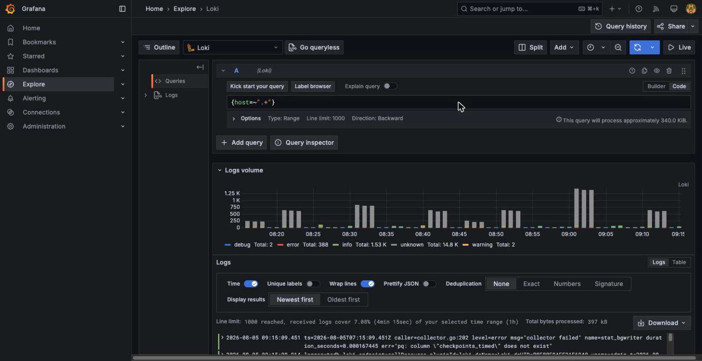

Loki (albo ELK) - dowody
==========================

- [X] Uruchomiony, gotowy do przyjmowania logów
- [X] Logi spływają z całej floty (9 hostów), nie tylko z jednej maszyny
- [X] Zapytywalny przez LogQL (etykiety, nie tylko surowy tekst)

## Dowody zebrane na żywo (2026-08-05)

Gotowość:

```
$ curl -s 10.0.120.20:3100/ready
ready
```

Etykiety dostępne do zapytań LogQL:

```
$ curl -s 10.0.120.20:3100/loki/api/v1/labels | jq
["container", "host", "job", "level", "service_name", "stream", "unit"]
```

Logi z min. 8 hostów (potwierdzone automatycznie przez
`scripts/smoke-test.sh`, sekcja 3 - sprawdza rozkład etykiety `host`):

```
✓ Loki: logi z 9 hostow (min. 8)
```

## Jak to jest zrobione

| Element | Plik |
|---|---|
| Loki (odbiornik) w stosie monitoringu | [ansible/roles/monitoring/templates/compose.yml.j2](../../ansible/roles/monitoring/templates/compose.yml.j2) |
| Agent logów na każdej maszynie (Grafana Alloy) | [ansible/roles/alloy/](../../ansible/roles/alloy/) - journald wszędzie, logi kontenerów tam, gdzie stoi Docker |
| Zastosowanie roli `alloy` na wszystkich hostach | `ansible/playbook.yml`, `hosts: all` |
| Firewall dopuszczający push z całej sieci wewnętrznej | reguła `3100/tcp ALLOW IN 10.0.0.0/16 # Loki - push z Alloy` (zob. [firewall.md](firewall.md)) |

## Świadome decyzje / ograniczenia

- **Loki, nie ELK** - jeden binarny proces zamiast Elasticsearch + Logstash
  + Kibana, dopasowany do budżetu pamięci tej maszyny (dzieli ją z
  Prometheusem, Grafaną i Alertmanagerem).
- **Alloy zamiast Promtaila** - następca Promtaila polecany przez Grafana
  Labs, jeden agent do logów (journald + kontenery) zamiast osobnych
  konfiguracji per źródło.
- **Etykiety ograniczone do `container/host/job/level/service_name/
  stream/unit`** - świadomie płaski zestaw etykiet (cardinality pod
  kontrolą); treść logu (np. pola JSON aplikacji) jest przeszukiwana przez
  filtr LogQL na treści, nie przez dodatkowe etykiety.
- **Loki stoi poza klastrem k3s**, w tym samym Compose co Prometheus/Grafana
  - te same powody odporności na awarię monitorowanej infrastruktury, co w
  [prometheus.md](prometheus.md).

## Zrzuty ekranu



Related evidence: [grafana.md](grafana.md), [prometheus.md](prometheus.md).
