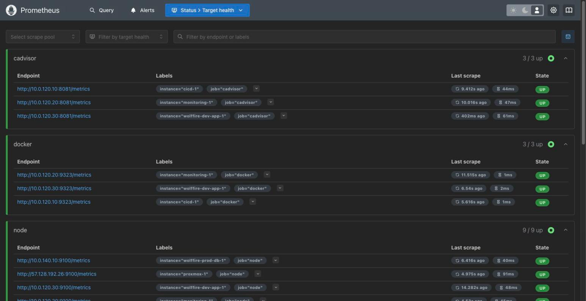
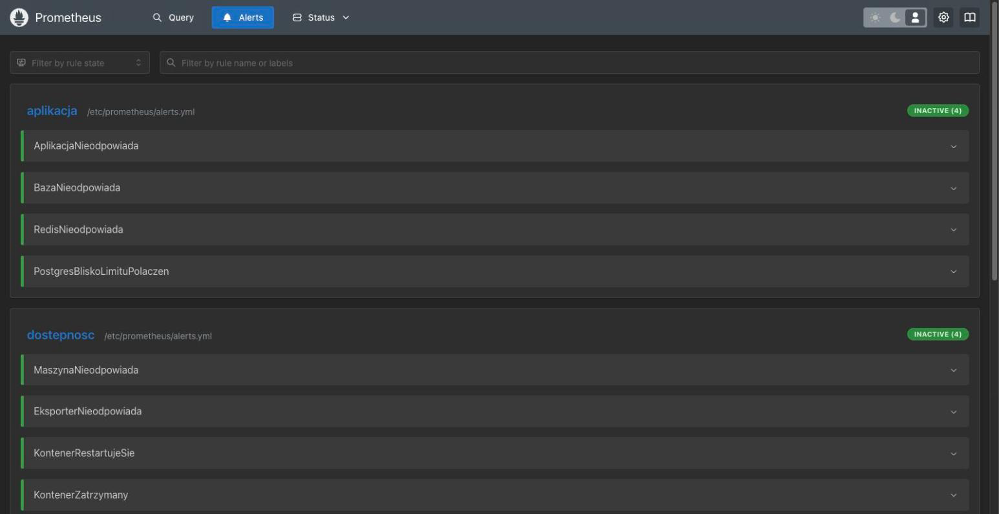

Prometheus - dowody
====================

- [X] Cele zdefiniowane jawnie (`scrape_configs`), nie operatorem
- [X] Wszystkie skonfigurowane cele `UP`
- [X] Reguły alertów zdefiniowane i ewaluowane

## Dowody zebrane na żywo (2026-08-05)

19 celów, wszystkie `up` - pokrywają hypervisor, wszystkie 8 VM, Docker,
cAdvisor, aplikację, bazę i sam Prometheusa:

```
$ curl -s 10.0.120.20:9090/api/v1/targets | jq -r '.data.activeTargets[] | "\(.labels.job) \(.labels.instance) \(.health)"'
cadvisor    cicd-1                up
cadvisor    monitoring-1          up
cadvisor    wolffire-dev-app-1    up
docker      cicd-1                up
docker      monitoring-1          up
docker      wolffire-dev-app-1    up
node        wolffire-prod-db-1    up
node        proxmox-1             up
node        wolffire-dev-app-1    up
node        monitoring-1          up
node        cicd-1                up
node        k3s-agent-1           up
node        k3s-agent-2           up
node        k3s-server-1          up
node        bastion-1             up
postgres    wolffire-prod-db-1    up
prometheus  localhost:9090        up
redis       wolffire-prod-db-1    up
wolffire    wolffire-dev-app-1    up
```

Zero celów DOWN (potwierdzone też automatycznie przez
`scripts/smoke-test.sh`, sekcja 3: „Prometheus: zero celow DOWN”).

15 reguł alertów załadowanych i ewaluowanych (jedna stale `firing` -
Watchdog, standardowy heartbeat potwierdzający, że sama ścieżka
alertowa żyje):

```
$ curl -s 10.0.120.20:9090/api/v1/rules | jq -r '.data.groups[].rules[] | .name+" state="+.state'
AplikacjaNieodpowiada        state=inactive
BazaNieodpowiada             state=inactive
RedisNieodpowiada            state=inactive
PostgresBliskoLimituPolaczen state=inactive
MaszynaNieodpowiada          state=inactive
EksporterNieodpowiada        state=inactive
KontenerRestartujeSie        state=inactive
KontenerZatrzymany           state=inactive
Watchdog                     state=firing
MaloMiejscaNaDysku            state=inactive
BrakMiejscaNaDysku            state=inactive
DyskZapelniSieWDobe           state=inactive
WysokieZuzyciePamieci         state=inactive
WysokieObciazenieCPU          state=inactive
RedisBliskoLimituPamieci      state=inactive
```

## Jak to jest zrobione

| Element | Plik |
|---|---|
| `scrape_configs` (ręcznie napisane, nie `ServiceMonitor`) | [ansible/roles/monitoring/templates/prometheus.yml.j2](../../ansible/roles/monitoring/templates/prometheus.yml.j2) |
| Reguły alertów | [ansible/roles/monitoring/templates/alerts.yml.j2](../../ansible/roles/monitoring/templates/alerts.yml.j2) |
| Compose stosu | [ansible/roles/monitoring/templates/compose.yml.j2](../../ansible/roles/monitoring/templates/compose.yml.j2) |
| Zmienne (adresy celów per grupa hostów) | [ansible/group_vars/observability/](../../ansible/group_vars/observability/) |

## Świadome decyzje / ograniczenia

- **Jawne `scrape_configs` zamiast operatora `kube-prometheus-stack`** -
  ręcznie napisana konfiguracja pokazuje zrozumienie działania Prometheusa
  wprost, a `kube-prometheus-stack` ciągnąłby operator, CRD i
  `kube-state-metrics` za ok. dwukrotnie większy koszt pamięci. Uzasadnienie:
  [ARCHITECTURE.md §9](../ARCHITECTURE.md#9-monitoring-poza-klastrem).
- **Prometheus stoi poza klastrem k3s**, na osobnej maszynie w Compose -
  monitoring, który pada razem z monitorowaną infrastrukturą, nie
  zaalarmuje o jej padnięciu.
- **Cel `wolffire` (job aplikacji) obejmuje tylko środowisko dev** - pody
  produkcyjne na k3s nie są jeszcze osobnym celem scrape (aplikacja w k3s
  nie eksponuje jeszcze `/metrics` jako oddzielny job Prometheusa); metryki
  węzłów i kontenerów k3s idą przez `node`/`cadvisor` per maszynę, nie przez
  scrape wewnątrz klastra.

## Zrzuty ekranu




Related evidence: [grafana.md](grafana.md), [alertmanager.md](alertmanager.md), [loki.md](loki.md).
