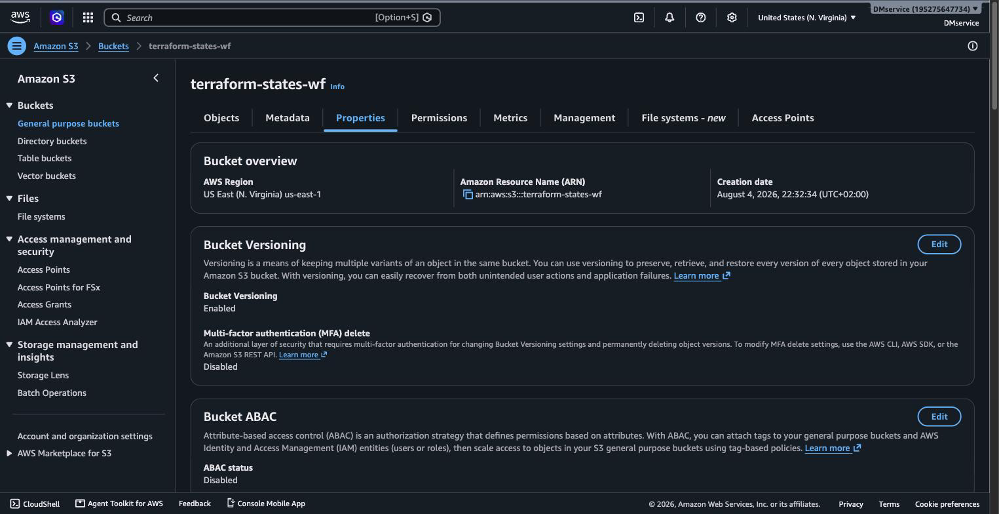

Terraform state w AWS S3 - dowody
==================================

- [X] Backend S3 skonfigurowany i aktywny
- [X] Wersjonowanie i szyfrowanie
- [X] Tożsamości IAM rozdzielone (stan / kopie zapasowe)

## Dowody zebrane na żywo (2026-08-05)

Backend deklarowany w kodzie:

```hcl
# terraform/providers.tf
backend "s3" {
  bucket       = "terraform-states-wf"
  key          = "terraform.tfstate"
  region       = "us-east-1"
  use_lockfile = true   # natywny lock S3, bez DynamoDB
  encrypt      = true
}
```

Bucket faktycznie istnieje i zawiera świeży stan (rozmiar rośnie z każdym
`apply`):

```
$ AWS_ACCESS_KEY_ID/... = tożsamość wolffire-tf-state
$ aws sts get-caller-identity
{"Arn": "arn:aws:iam::195275647734:user/wolffire-tf-state"}

$ aws s3 ls s3://terraform-states-wf/ --recursive
2026-08-05 03:18:59     268958 terraform.tfstate
```

Zasoby S3/IAM utworzone przez osobny root (`terraform/bootstrap`, stan
lokalny - problem kury i jajka, patrz niżej):

```
$ terraform -chdir=terraform/bootstrap state list
aws_s3_bucket.state
aws_s3_bucket_versioning.state
aws_s3_bucket_server_side_encryption_configuration.state
aws_s3_bucket_public_access_block.state
aws_s3_bucket_lifecycle_configuration.state
aws_s3_bucket.backups
aws_s3_bucket_versioning.backups
aws_s3_bucket_server_side_encryption_configuration.backups
aws_s3_bucket_public_access_block.backups
aws_s3_bucket_lifecycle_configuration.backups
aws_iam_user.tf_state
aws_iam_user.jenkins_backup
aws_iam_user_policy.tf_state
aws_iam_user_policy.jenkins_backup
aws_iam_access_key.tf_state
aws_iam_access_key.jenkins_backup
```

**Rozdział tożsamości działa naprawdę** - test na żywo tego samego wywołania
dwoma różnymi kluczami IAM:

```
$ # tożsamość tf_state próbuje dotknąć bucketa backupów -> odmowa
$ aws s3 ls s3://wolffire-backups/
AccessDenied: User wolffire-tf-state is not authorized to perform: s3:ListBucket
                on resource "arn:aws:s3:::wolffire-backups"

$ # tożsamość tf_state próbuje sprawdzić wersjonowanie własnego bucketa -> odmowa
$ # (polityka daje tylko ListBucket/Get/Put/DeleteObject, nie GetBucketVersioning)
$ aws s3api get-bucket-versioning --bucket terraform-states-wf
AccessDenied: not authorized to perform: s3:GetBucketVersioning

$ # tożsamość jenkins_backup widzi backupy, ale nie może ich skasować
$ aws sts get-caller-identity   # (z kluczem BACKUP_AWS_*)
{"Arn": "arn:aws:iam::195275647734:user/wolffire-jenkins-backup"}
$ aws s3 ls s3://wolffire-backups/ --recursive
2026-08-05 02:52:00        155 config
2026-08-05 02:53:28      56821 data/0c/0cc6962bf...
...
2026-08-05 02:53:28        436 snapshots/a1f2d1ce...
$ aws s3 rm s3://wolffire-backups/nonexistent-test-object.txt
AccessDenied: not authorized to perform: s3:DeleteObject ... explicit deny in an identity-based policy
```

## Jak to jest zrobione

| Element | Plik |
|---|---|
| Backend główny | [terraform/providers.tf](../../terraform/providers.tf) |
| Bucket stanu + IAM `tf_state` | [terraform/bootstrap/main.tf](../../terraform/bootstrap/main.tf), [iam.tf](../../terraform/bootstrap/iam.tf) |
| Bucket kopii + IAM `jenkins_backup` (bez `DeleteObject`) | ten sam plik `iam.tf` - `statement { sid = "DenyDelete" effect = "Deny" }` |

## Świadome decyzje / ograniczenia

- **`use_lockfile = true` zamiast DynamoDB** - S3 natywnie obsługuje teraz
  blokadę stanu (Terraform 1.11+), więc nie ma potrzeby utrzymywania osobnej
  tabeli.
- **`terraform/bootstrap` ma stan lokalny, celowo, nie w S3** - tworzy
  bucket, w którym dopiero mógłby mieszkać stan reszty infrastruktury; plik
  stanu jest w `.gitignore`, bo zawiera klucze IAM jawnym tekstem.
- **Jenkins nie ma prawa usuwać kopii zapasowych** (`DenyDelete` jawnie w
  polityce) - nawet przejęty token CI nie skasuje backupów. Retencja
  (90 dni + przejście do Glacier IR po 30) jest regułą cyklu życia bucketa,
  nie akcją aplikacji.
- **`random_password` administratora Proxmoxa trafia do stanu jawnym
  tekstem** - dlatego bucket stanu ma szyfrowanie SSE-S3, blokadę dostępu
  publicznego i wąskie IAM (tylko `ListBucket`/`GetObject`/`PutObject`/
  `DeleteObject`, żadnych uprawnień administracyjnych na bucket).

## Zrzuty ekranu



Related evidence: [terraform.md](terraform.md), [jcasc.md](jcasc.md) (zadanie backupowe Jenkinsa korzystające z drugiego bucketa).
