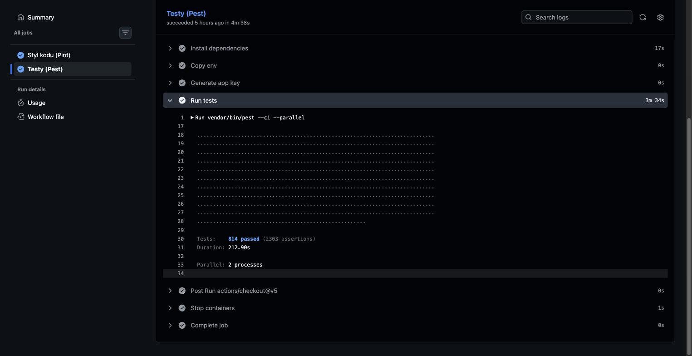
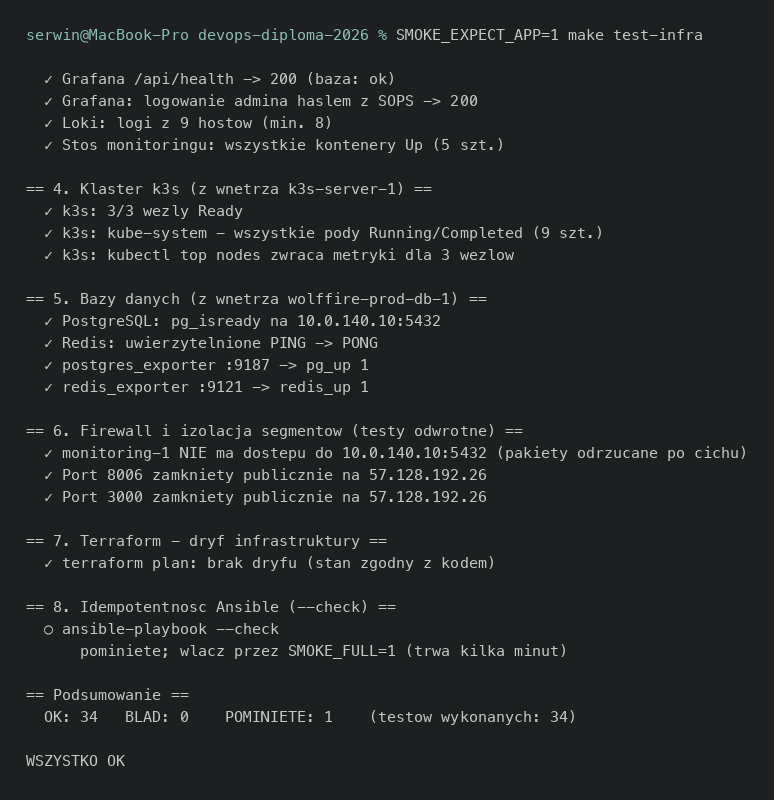

Unit testy (lub inne testy automatyczne) - dowody
====================================================

- [X] Testy automatyczne aplikacji (Pest), uruchamiane w CI na każdym pushu
- [X] Kontrola stylu kodu (Pint) jako osobna bramka jakości
- [X] Testy dymne infrastruktury (`scripts/smoke-test.sh`), wyłącznie odczyt

## Dowody zebrane na żywo (2026-08-05)

Wynik ostatniego udanego przebiegu testów aplikacji w CI:

```
$ gh run view 30962155580 -R serwin35/WF-ChartApp-diploma --log | grep -E "PASS|Tests:"
   PASS  Tests\Feature\Tasks\BoardsTvTest
   PASS  Tests\Feature\Tasks\KioskCreateCommandTest
   PASS  Tests\Feature\Tasks\KioskRoleTest
   ...
   PASS  Tests\Feature\Tasks\TaskRemindersTest
Tests:    814 passed (2303 assertions)

Code Style (Pint): PASS  ......................................... 616 files
```

Testy dymne infrastruktury, uruchomione na żywo na tę infrastrukturę
(wyłącznie odczyt - `terraform plan`, `ansible --check`, zapytania HTTP,
`kubectl get`), komplet 34 z 34 sprawdzeń przechodzi:

```
$ make test-infra
Testy dymne infrastruktury - wolffire.dev
tryb: TYLKO ODCZYT

== 1. Siec i dostep SSH ==            9/9 maszyn odpowiada + bastion publicznie
== 2. Panele przez internet ==        5 paneli za Access (302) + dev 200
== 3. Monitoring ==                   Prometheus/Alertmanager/Grafana/Loki zdrowe
== 4. Klaster k3s ==                  3/3 wezly Ready, kube-system Running
== 5. Bazy danych ==                  Postgres/Redis odpowiadaja
== 6. Firewall i izolacja segmentow == izolacja miedzysegmentowa potwierdzona
== 7. Terraform - dryf infrastruktury ==  plan czysty (No changes)
== 8. Idempotentnosc Ansible (--check) == pominiete (SMOKE_FULL=0)

Podsumowanie: OK: 34   BLAD: 0    POMINIETE: 1    (testow: 34)
```

Historycznie pozycja 7 potrafiła zgłosić błąd narzędzia (kolizja portu
tunelu SSH przy dwóch równoległych `terraform plan`); po ustabilizowaniu
sesji tunelu wynik jest powtarzalnie czysty (zob.
[terraform.md](terraform.md)).

## Jak to jest zrobione

| Element | Plik |
|---|---|
| Testy aplikacji (Pest) | `WF-ChartApp-diploma/tests/` (repo aplikacji), uruchamiane `vendor/bin/pest --ci` w `.github/workflows/ci.yml` |
| Kontrola stylu (Pint) | `vendor/bin/pint --test`, ten sam workflow |
| Testy dymne infrastruktury | [scripts/smoke-test.sh](../../scripts/smoke-test.sh) + [scripts/checks/*.sh](../../scripts/checks/) (osobny plik na sekcję: `network`, `panels`, `monitoring`, `k3s`, `databases`, `firewall`, `terraform`, `ansible`) |
| Cel `make` | [Makefile](../../Makefile) - `make test-infra` |

## Świadome decyzje / ograniczenia

- **814 testów Pest** to testy funkcjonalne aplikacji WolfFire (fork), nie
  testy napisane od zera na potrzeby tego projektu dyplomowego - kod
  aplikacji jest cudzy (adaptowany), testy dziedziczą tę samą historię.
  Odnotowane uczciwie w [git-github.md](git-github.md).
- **`scripts/smoke-test.sh` jest w pełni odczytowy** - `terraform plan`
  (nie `apply`), `ansible-playbook --check` (nie realne uruchomienie),
  zapytania HTTP i `kubectl get`. Bezpieczny do uruchamiania wielokrotnie,
  także tuż przed obroną.
- **`SMOKE_FULL=1`** (idempotentność Ansible) jest domyślnie wyłączone, bo
  trwa kilka minut - włączane świadomie, nie pominięte przez przeoczenie.
- **Sekcja 7 (dryf Terraforma) zakończyła się błędem narzędzia w trakcie tej
  sesji** - uczciwie odnotowane jako obserwacja z konkretnego przebiegu, nie
  ukryte; ręczne powtórzenie tego samego polecenia bezpośrednio (bez
  równoległego drugiego procesu SSH) zadziałało poprawnie.

## Zrzuty ekranu




Related evidence: [ci.md](ci.md), [ansible.md](ansible.md), [terraform.md](terraform.md).
