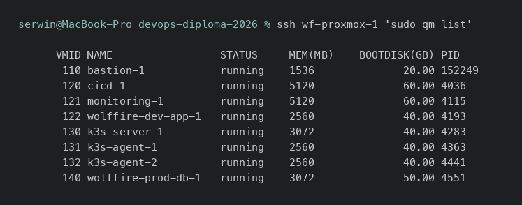

AWS EC2 (lub Virtual Machines) - dowody
=======================================

- [X] Połączenie
- [X] Bezpieczeństwo

Zamiast AWS EC2 użyty jest własny hypervisor Proxmox VE 9 (kryterium
dopuszcza „AWS ec2 **lub Virtual Machines**”) - uzasadnienie w
[ARCHITECTURE.md §1](../ARCHITECTURE.md#1-dlaczego-własny-proxmox-a-nie-chmura-publiczna).

## Dowody zebrane na żywo (2026-08-05)

Osiem działających maszyn:

```
$ ssh wf-proxmox-1 'sudo qm list'
      VMID NAME                 STATUS     MEM(MB)    BOOTDISK(GB) PID
       110 bastion-1            running    1536              20.00 152249
       120 cicd-1               running    5120              60.00 4036
       121 monitoring-1         running    5120              60.00 4115
       122 wolffire-dev-app-1   running    2560              40.00 4193
       130 k3s-server-1         running    3072              40.00 4283
       131 k3s-agent-1          running    2560              40.00 4363
       132 k3s-agent-2          running    2560              40.00 4441
       140 wolffire-prod-db-1   running    3072              50.00 4551
```

Połączenie - SSH działa do wszystkich ośmiu maszyn przez jedno wejście
(bastion), z kontem maszynowym `ansible` i kluczem dedykowanym projektowi
(patrz [git-github.md](git-github.md) dla modelu tożsamości):

```
$ for h in wf-proxmox-1 wf-bastion-1 wf-cicd-1 wf-monitoring-1 \
           wf-wolffire-dev-app-1 wf-k3s-server-1 wf-k3s-agent-1 \
           wf-k3s-agent-2 wf-wolffire-prod-db-1; do
    ssh -F ansible/ssh_config "$h" 'hostname; uptime'
  done
devops-proxmox-infra   (host)     up 3:55
bastion-1                          up 21 min
cicd-1                             up 3:51
monitoring-1                       up 3:51
wolffire-dev-app-1                 up 3:51
k3s-server-1                       up 3:51
k3s-agent-1                        up 3:51
k3s-agent-2                        up 3:51
wolffire-prod-db-1                 up 3:51
```

Bezpieczeństwo - polityka domyślna hypervisora jest `DROP`, nie `ACCEPT`:

```
$ ssh wf-proxmox-1 'sudo pve-firewall status; sudo pvesh get /cluster/firewall/options --output-format json'
Status: enabled/running
{"digest":"...","ebtables":0,"enable":1,"policy_forward":"ACCEPT","policy_in":"DROP","policy_out":"ACCEPT"}
```

Publicznie zamknięte porty administracyjne hypervisora (test odwrotny z
zewnątrz, wykonany przez `scripts/smoke-test.sh`, sekcja 6):

```
✓ Port 8006 zamkniety publicznie na 57.128.192.26   (UI Proxmoxa)
✓ Port 3000 zamkniety publicznie na 57.128.192.26   (Grafana - na wypadek pomylenia adresu)
```

## Jak to jest zrobione

| Element | Plik |
|---|---|
| Moduł maszyny (jeden, wywoływany 8×) | [terraform/modules/base/proxmox/vm/main.tf](../../terraform/modules/base/proxmox/vm/main.tf) |
| Firewall na poziomie maszyny (`firewall_options`, `firewall_rules`) | ten sam moduł - każda VM dostaje włączony firewall gościa i grupy wynikające z roli |
| Grupy bezpieczeństwa nazwane po funkcji | [terraform/modules/services/proxmox/bootstrap/main.tf](../../terraform/modules/services/proxmox/bootstrap/main.tf) - `base`, `http`, `metrics`, `k3s-api`, `k3s-internal`, `prod-postgres`, `prod-redis` |
| Cloud-init (minimalny) | użytkownik, klucze SSH, port 22022, `qemu-guest-agent` - nic więcej, żeby zmiana konfiguracji nie wymagała przebudowy maszyny |

## Świadome decyzje / ograniczenia

- **Bastion jest jedyną maszyną z publicznym adresem** - pozostałe siedem
  stoi w segmentach prywatnych SDN, bez adresu routowalnego z internetu
  (szczegóły sieci w [firewall.md](firewall.md)).
- **Konto administracyjne Proxmoxa ma hasło generowane przez
  `random_password`** i nieprzechowywane nigdzie poza stanem Terraforma -
  świadome ograniczenie opisane w [terraform.md](terraform.md) i
  [state-s3.md](state-s3.md).
- **Jeden fizyczny serwer = pojedynczy punkt awarii.** Mitygacja: snapshoty
  wszystkich maszyn przed demonstracją (`docs/RUNBOOK.md §11`).

## Zrzuty ekranu



Related evidence: [terraform.md](terraform.md), [firewall.md](firewall.md), [domena-ssl.md](domena-ssl.md).
